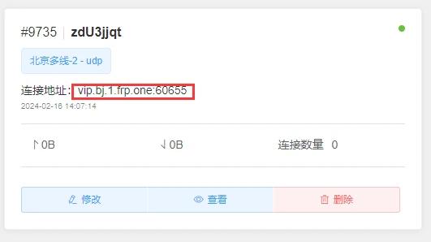
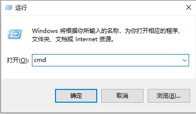
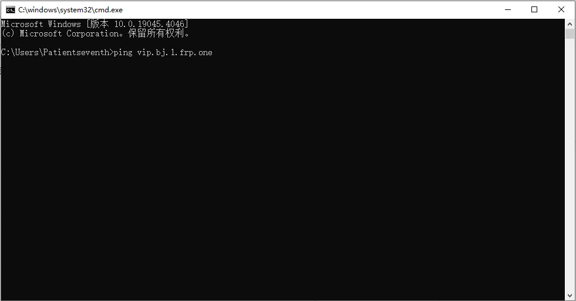
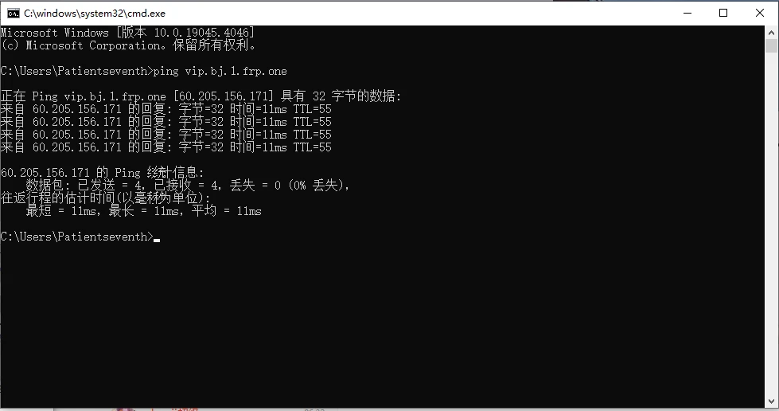
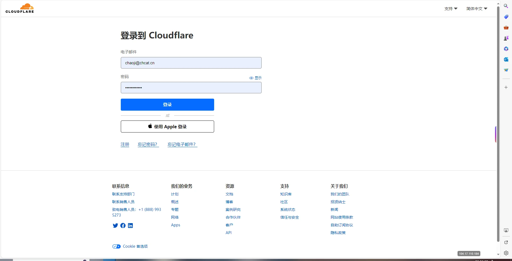
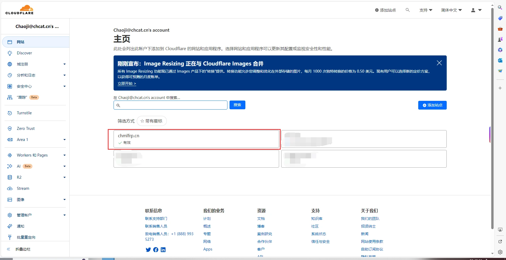
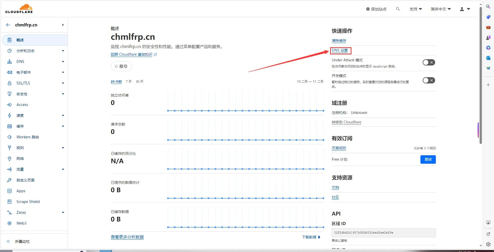
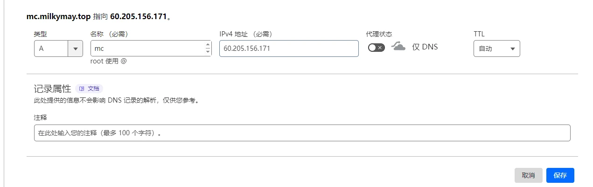

# A解析教程

## 前言

解析域名的前提是您需要有域名。域名可前往[腾讯云](https://cloud.tencent.com)/[阿里云](https://www.aliyun.com)/[GoDaddy](https://www.godaddy.com)等服务商购买。

所有服务商的SRV解析都是同理，如果为其他服务商，一样照抄即可。

## Cloudflare解析教程

首先 找到frp所对应的链接地址



比如我这个就是

```shell
vip.bj.1.frp.one:60655
```

<kbd>win</kbd>+<kbd>R</kbd>键呼出运行框  
输入cmd  



输入ping [frp域名]
比如北京多线2就是

```
ping vip.bj.1.frp.one
```

**注意：不要带端口 也就是冒号和后面的数字**



回车
等待它输出

```
正在 Ping vip.bj.1.frp.one [60.205.156.171] 具有 32 字节的数据:
```



即可  
60.205.156.171就是北京多线2的IP  
然后打开[cloudflare](https://www.cloudflare-cn.com/)

输入你的账号密码进行登录



选择你需要挂解析的域名



点击右上方的DNS设置



点击添加记录


输入以下内容

- 类型：A
- 名称：你想要的前缀(mc.xxxx.xx就写mc xyz.xxxx.xx就写xyz)
- IPV4地址：上面cmd输出的IP 北京多线2就是60.205.156.171
- 代理状态：关闭
- TTL：自动



点击右下角保存 等待其生效即可