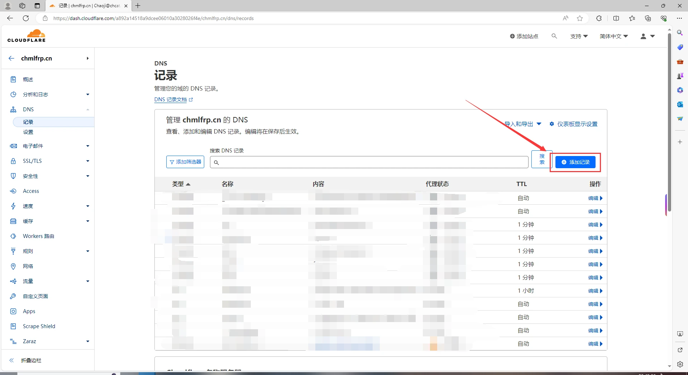

# A记录解析教程

A记录（Address Record）是DNS解析中最常用的记录类型，用于将域名指向IPv4地址。本教程将指导您如何配置A记录解析，让您的域名直接指向ChmlFrp服务器的IP地址。

## 前置条件

在开始之前，请确保您已具备以下条件：

- ✅ 已拥有一个域名
- ✅ 域名已添加到DNS服务商
- ✅ 已创建ChmlFrp隧道并获取连接地址
- ✅ 了解基本的DNS概念和命令行操作

> **💡 域名获取**  
> 如果您还没有域名，可以前往以下服务商购买：
> - [腾讯云](https://cloud.tencent.com)
> - [阿里云](https://www.aliyun.com)
> - [GoDaddy](https://www.godaddy.com)
> - [Cloudflare](https://www.cloudflare.com)

## 第一步：获取服务器IP地址

### 1. 查看ChmlFrp连接地址

1. **登录控制台**
   - 访问 [ChmlFrp控制台](https://panel.chmlfrp.cn)
   - 进入"隧道列表"页面

2. **获取连接地址**
   - 找到您要配置的隧道
   - 复制连接地址（如：`vip.bj.1.frp.one:60655`）


> **💡 地址示例**  
> 连接地址格式通常为：`域名:端口号`  
> 例如：`vip.bj.1.frp.one:60655`

### 2. 使用Ping命令获取IP

1. **打开命令提示符**
   - 按 <kbd>Win</kbd> + <kbd>R</kbd> 键打开运行窗口
   - 输入 `cmd` 并回车


2. **执行Ping命令**
   - 输入ping命令（**注意：不要包含端口号**）

```bash
ping vip.bj.1.frp.one
```


3. **获取IP地址**
   - 等待命令执行完成
   - 从输出结果中提取IP地址

```bash
正在 Ping vip.bj.1.frp.one [60.205.156.171] 具有 32 字节的数据:
```


> **💡 重要提示**  
> - 只使用域名部分，不要包含端口号（冒号后的数字）
> - 记录下输出的IP地址，后续配置会用到
> - 示例中的IP地址是：`60.205.156.171`

## 第二步：配置A记录

### Cloudflare解析教程

#### 1. 登录Cloudflare

1. **访问官网**
   - 打开 [Cloudflare控制台](https://dash.cloudflare.com/)
   - 输入账号密码进行登录


2. **选择域名**
   - 在控制台中选择需要配置解析的域名


#### 2. 配置A记录

1. **进入DNS设置**
   - 点击右上方的"DNS"设置


2. **添加记录**
   - 点击"添加记录"按钮



3. **填写A记录信息**
   - **类型**：选择 `A`
   - **名称**：填写子域名前缀（如：`mc`、`api`、`www`等）
   - **IPv4地址**：填写从ping命令获取的IP地址
   - **代理状态**：选择"关闭"（重要！）
   - **TTL**：选择"自动"


> **💡 配置示例**  
> 假设您想通过 `mc.yourdomain.com` 访问服务：
> - **类型**：A
> - **名称**：mc
> - **IPv4地址**：60.205.156.171
> - **代理状态**：关闭
> - **TTL**：自动

4. **保存配置**
   - 点击右下角的"保存"按钮
   - 等待DNS记录生效（通常需要几分钟到几小时）

## 其他DNS服务商配置

### 腾讯云解析

1. 登录腾讯云控制台
2. 进入"云解析（DNSPod）"服务
3. 选择域名，点击"解析"
4. 添加记录，类型选择"A"
5. 填写主机记录和记录值（IP地址）

### 阿里云解析

1. 登录阿里云控制台
2. 进入"云解析DNS"服务
3. 选择域名，点击"解析设置"
4. 添加记录，类型选择"A"
5. 填写主机记录和记录值

### GoDaddy解析

1. 登录GoDaddy账户
2. 进入"我的产品" → "DNS管理"
3. 选择域名，点击"管理"
4. 添加记录，类型选择"A"
5. 填写名称和值

## 验证解析

### 1. 使用命令行验证

```bash
# Windows
nslookup mc.yourdomain.com

# Linux/macOS
dig mc.yourdomain.com
```

### 2. 在线工具验证

- [DNS Checker](https://dnschecker.org/)
- [What's My DNS](https://whatsmydns.net/)

### 3. 浏览器测试

- 在浏览器中访问您的域名
- 检查是否能正常访问服务

## 故障排除

### 常见问题

**Q: 解析不生效怎么办？**  
A: 请检查：
- A记录配置是否正确
- IP地址是否准确
- 代理状态是否关闭（Cloudflare）
- 是否等待足够时间（最长24小时）

**Q: 访问域名显示错误？**  
A: 请确认：
- 隧道是否正常运行
- IP地址是否正确
- 域名是否已备案（国内节点）
- 端口是否正确配置