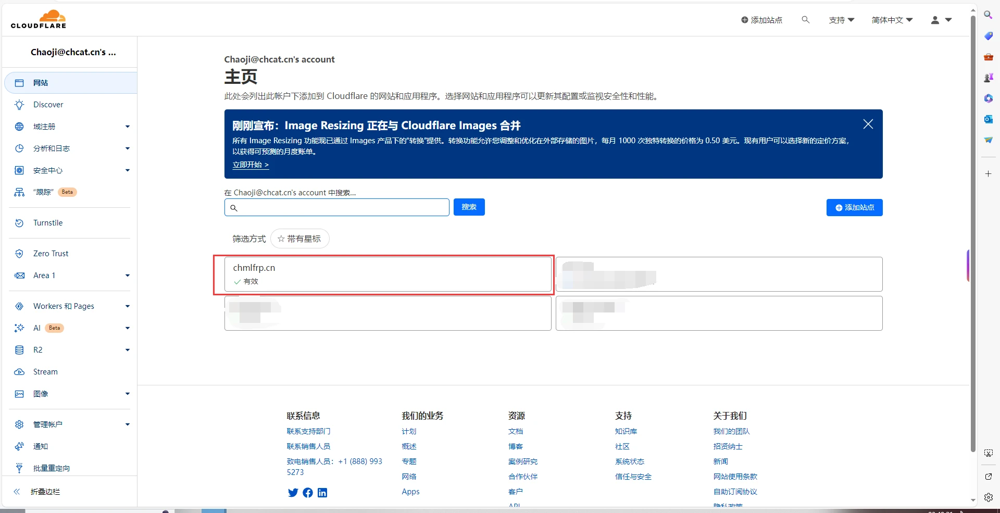
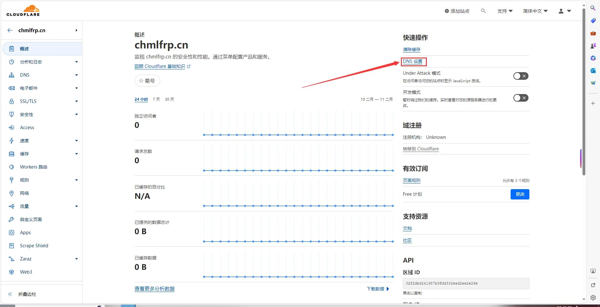
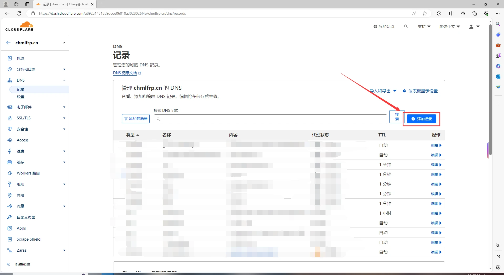
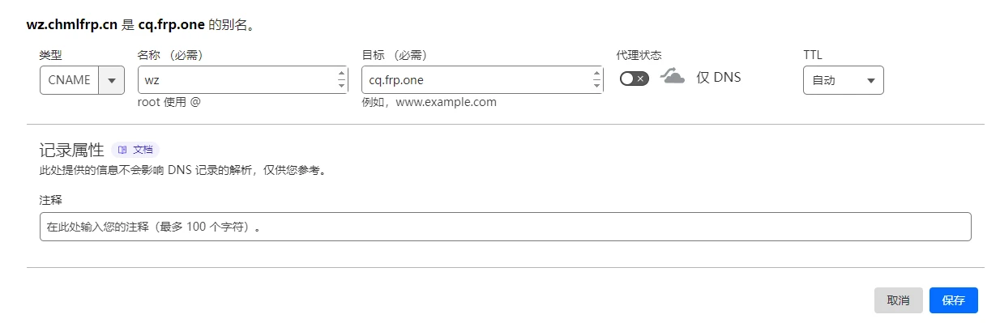

# CNAME解析教程

## 前言

解析域名的前提是您需要有域名。域名可前往[腾讯云](https://cloud.tencent.com)/[阿里云](https://www.aliyun.com)/[GoDaddy](https://www.godaddy.com)等服务商购买。

所有服务商的SRV解析都是同理，如果为其他服务商，一样照抄即可。

------------

## Cloudflare解析教程

首先打开[Cloudflare的官网](https://dash.cloudflare.com/)

输入你的账号密码进行登录

选择你需要挂解析的域名

点击右上方的DNS设置

点击添加记录

输入以下内容

 - 类型：CNAME
 - 名称：你想要的前缀(wz.xxxx.xx就写mc xyz.xxxx.xx就写xyz)
 - 目标：所要对应的域名(创建隧道的时候它下面会给出"请将 XX.XXX.XX 域名通过CNAME或SRV解析至 xg.frp.one")

假如您的隧道解析地址为：bj.frp.one，再假如您的域名为chmlfrp.cn，然后您想通过wz.chmlfrp.cn进服务器，则这样填

 - 类型：CNAME
 - 名称：wz
 - 目标：bj.frp.one

点击右下角的保存

等待其生效即可