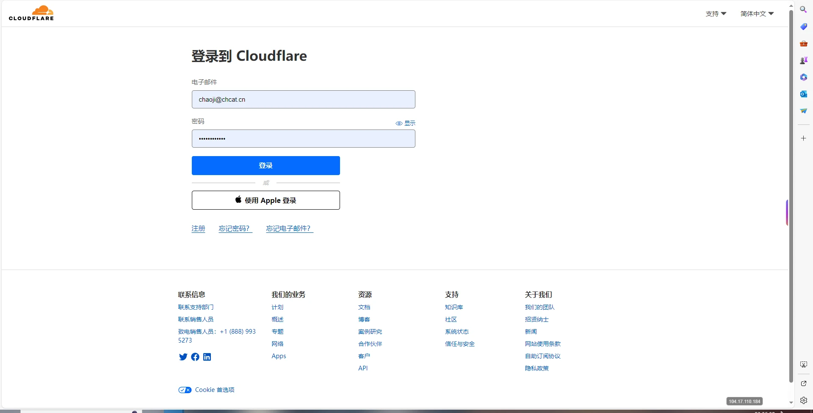

# CNAME解析教程

CNAME（Canonical Name）记录是DNS解析中的一种记录类型，用于将域名指向另一个域名。本教程将指导您如何在不同DNS服务商中配置CNAME解析。

## 前置条件

在开始之前，请确保您已具备以下条件：

- ✅ 已拥有一个域名
- ✅ 域名已添加到DNS服务商
- ✅ 已创建ChmlFrp隧道并获取解析地址
- ✅ 了解基本的DNS概念

> **💡 域名获取**  
> 如果您还没有域名，可以前往以下服务商购买：
> - [腾讯云](https://cloud.tencent.com)
> - [阿里云](https://www.aliyun.com)
> - [GoDaddy](https://www.godaddy.com)
> - [Cloudflare](https://www.cloudflare.com)

## 解析原理

CNAME解析的工作原理：

1. **用户访问**：用户访问 `wz.yourdomain.com`
2. **DNS查询**：DNS服务器查找CNAME记录
3. **重定向**：将请求重定向到 `bj.frp.one`
4. **服务访问**：最终访问到ChmlFrp服务器

## Cloudflare解析教程

### 1. 登录Cloudflare

1. **访问官网**
   - 打开 [Cloudflare控制台](https://dash.cloudflare.com/)
   - 输入账号密码进行登录



2. **选择域名**
   - 在控制台中选择需要配置解析的域名


### 2. 配置DNS记录

1. **进入DNS设置**
   - 点击右上方的"DNS"设置


2. **添加记录**
   - 点击"添加记录"按钮


3. **填写解析信息**
   - **类型**：选择 `CNAME`
   - **名称**：填写子域名前缀（如：`wz`、`mc`、`api`等）
   - **目标**：填写ChmlFrp提供的解析地址

> **💡 配置示例**  
> 假设您的隧道解析地址为：`bj.frp.one`，域名为：`chmlfrp.cn`，想要通过 `wz.chmlfrp.cn` 访问服务：
> - **类型**：CNAME
> - **名称**：wz
> - **目标**：bj.frp.one


4. **保存配置**
   - 点击右下角的"保存"按钮
   - 等待DNS记录生效（通常需要几分钟到几小时）

## 腾讯云解析教程

### 1. 进入云解析控制台

1. **访问腾讯云**
   - 登录 [腾讯云控制台](https://console.cloud.tencent.com)
   - 进入"云解析（DNSPod）"服务

2. **选择域名**
   - 在左侧菜单找到"权威解析"
   - 选择需要配置的域名
   - 点击"解析"按钮


### 2. 添加CNAME记录

1. **创建记录**
   - 点击"添加记录"按钮
   - 选择记录类型为"CNAME"

2. **填写配置信息**
   - **主机记录**：填写子域名前缀
   - **记录值**：填写ChmlFrp解析地址
   - **TTL**：建议设置为600秒（10分钟）


3. **保存记录**
   - 检查配置无误后点击"确定"
   - 等待DNS记录生效

## 其他DNS服务商

### 阿里云解析

1. 登录阿里云控制台
2. 进入"云解析DNS"服务
3. 选择域名，点击"解析设置"
4. 添加记录，类型选择"CNAME"
5. 填写主机记录和记录值

### GoDaddy解析

1. 登录GoDaddy账户
2. 进入"我的产品" → "DNS管理"
3. 选择域名，点击"管理"
4. 添加记录，类型选择"CNAME"
5. 填写名称和值

## 验证解析

### 1. 使用命令行验证

```bash
# Windows
nslookup wz.yourdomain.com

# Linux/macOS
dig wz.yourdomain.com
```

### 2. 在线工具验证

- [DNS Checker](https://dnschecker.org/)
- [What's My DNS](https://whatsmydns.net/)
