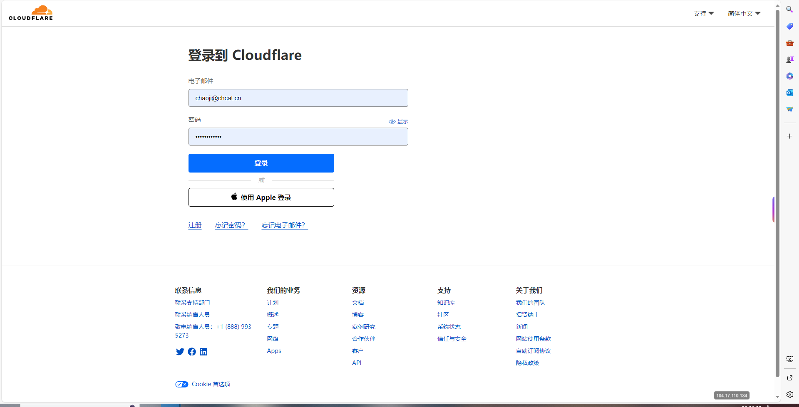
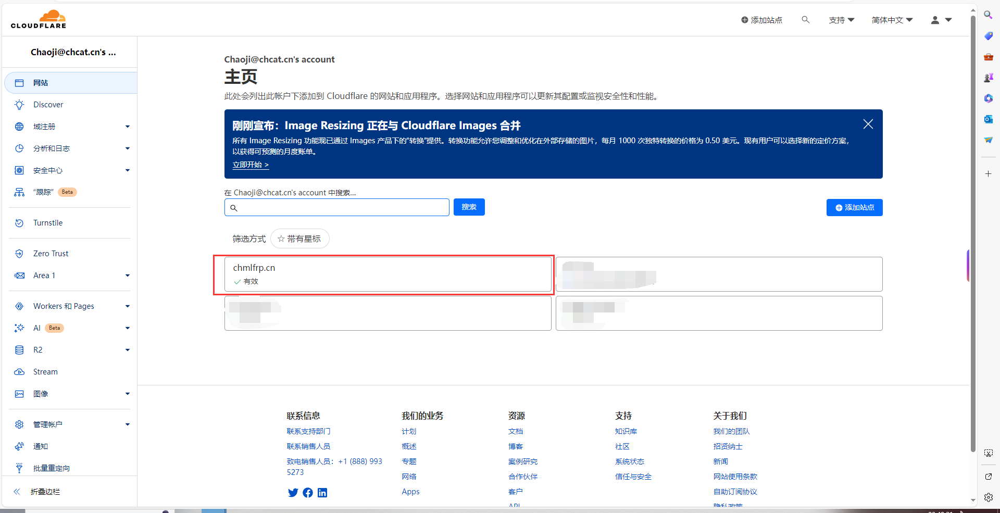
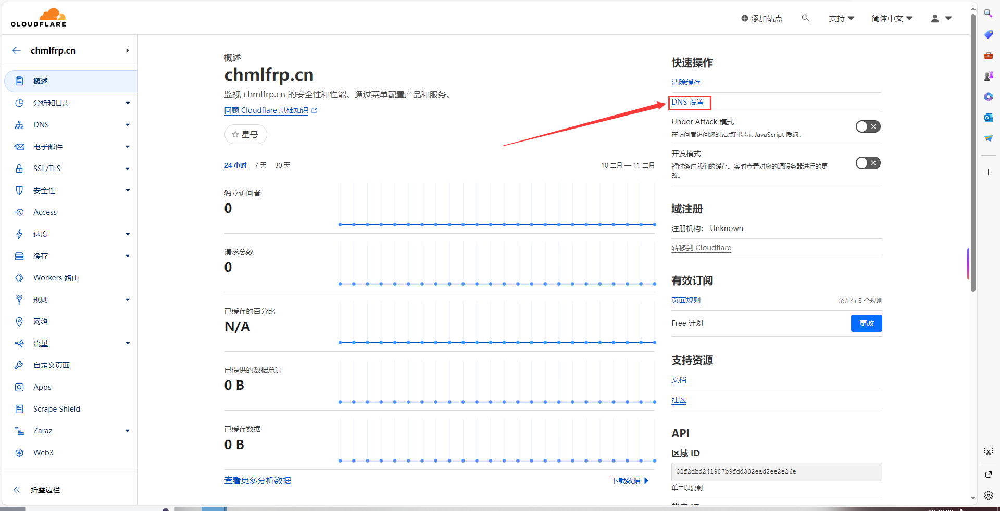
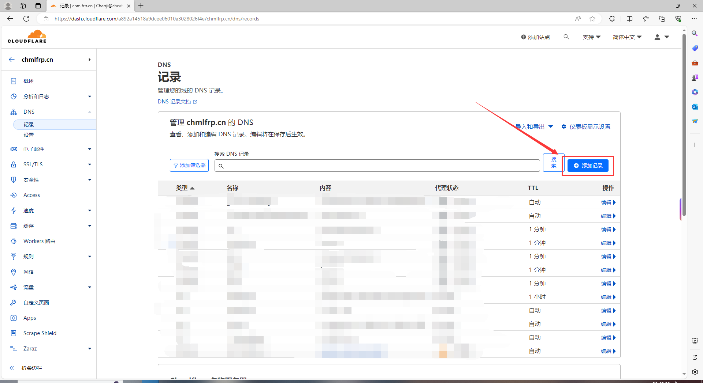
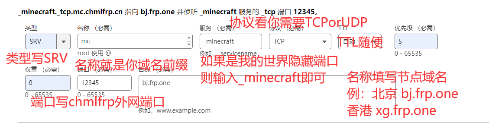
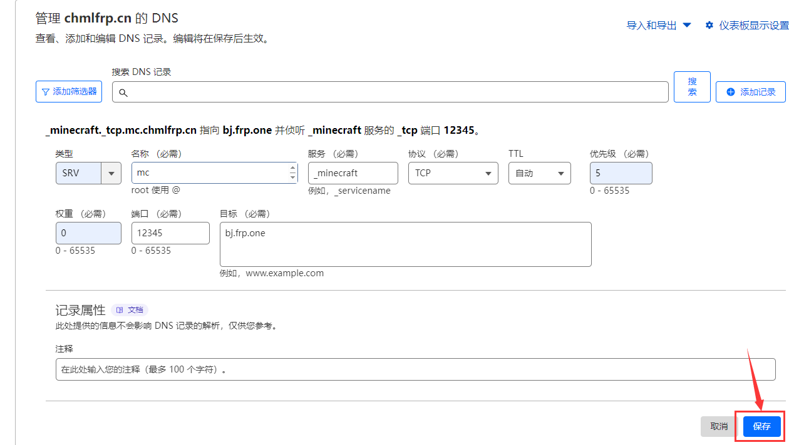

# SRV解析教程

## 前言

SRV解析一般用于MCJAVA服务端隐藏端口连接服务器等，此教程仅提供隐藏java MC连接端口SRV解析教程。

注意！解析域名的前提是您需要有域名。域名可前往[腾讯云](https://cloud.tencent.com)/[阿里云](https://www.aliyun.com)/[GoDaddy](https://www.godaddy.com)等服务商购买。

所有服务商的SRV解析都是同理，如果为其他服务商，一样照抄即可。

## Cloudflare解析教程

首先打开[Cloudflare的官网](https://dash.cloudflare.com/)

输入你的账号密码进行登录

选择你需要挂解析的域名

点击右上方的DNS设置

点击添加记录

输入以下内容

 - 类型：SRV
 - 名称：你想要的前缀(mc.xxxx.xx就写mc xyz.xxxx.xx就写xyz)
 - 服务：如果你是要我的世界隐藏端口 就输入_minecraft即可
 - 协议：可选TCP/UDP
 - TTL：刷新时间 可随便填
 - 优先级：如果是我的世界 则照抄即可 如果是别的 请查阅其相关文档
 - 权重：如果是我的世界 则照抄即可 如果是别的 请查阅其相关文档
 - 端口：填写chmlfrp中给出的外网端口
 - 目标：填写chmlfrp的节点域名

假如您的MC链接地址为：bj.frp.one:12345，再假如您的域名为chmlfrp.cn，然后您想通过mc.chmlfrp.cn进服务器，则这样填：

 - 类型：SRV
 - 名称：mc
 - 服务：_minecraft
 - 协议：TCP
 - TTL：自动
 - 优先级：5
 - 权重：0
 - 端口：12345
 - 目标：bj.frp.one

点击右下角的保存

等待其生效即可

