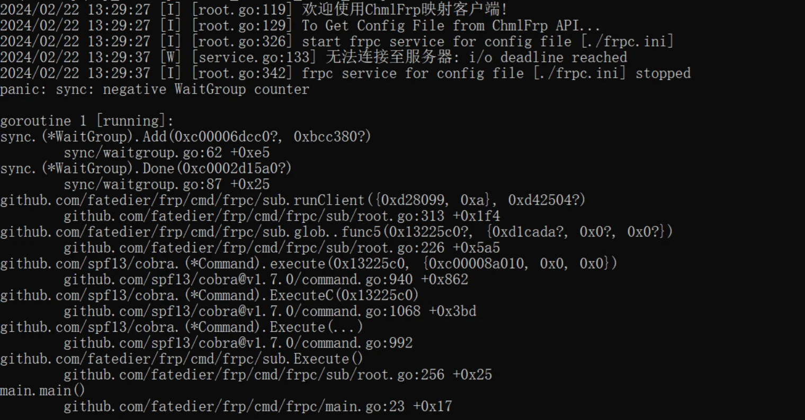
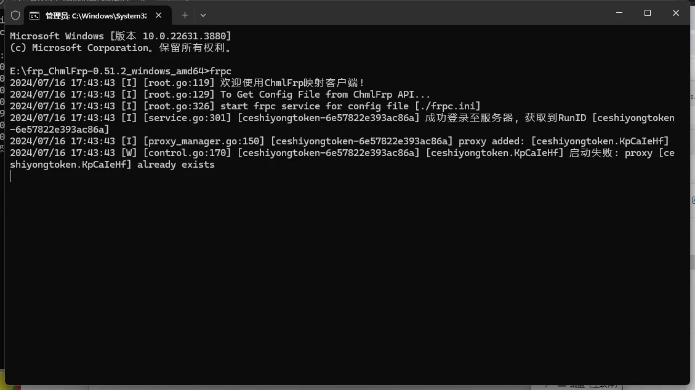
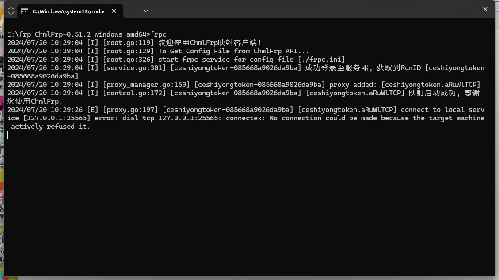

## 无法连接至服务器(i/o deadline reached)

如果软件出现这个问题，代表您连接的节点已离线，或者节点ip不正确，也可能您连接不上此节点服务器。

出现此问题有以下可能的原因：

 - 节点服务器意外重启
 - 节点被攻击
 - 节点已废弃



**解决方法为更换节点**，可以前往[ChmlFrp监控](https://panel.chmlfrp.cn/tunnel/status)查看节点状态。

## 客户端代理参数错误,配置文件与记录不匹配

**报错示例**
```shell
2024/02/22 15:08:02 [I] [root.go:118] 欢迎使用ChmlFrp客户端 v0.51.0
2024/02/22 15:08:02 [I] [root.go:264] start frpc service for config file [./frpc.ini]
2024/02/22 15:08:04 [I] [service.go:301] [token-6e447a2e28fdb4d0] 成功登录至服务器, 获取到RunID [token-6e447a2e28fdb4d0]
2024/02/22 15:08:04 [I] [proxy_manager.go:150] [token-6e447a2e28fdb4d0] proxy added: [token.zorZVKi]
2024/02/22 15:08:05 [W] [control.go:170] [token-6e447a2e28fdb4d0] [token.zorZVKi] 启动失败: 客户端代理参数错误，配置文件与记录不匹配。请不要随意修改配置文件！
```
此报错代表您的frpc.ini配置文件不正确，请检查frpc.ini的内容和管理面板中配置文件的内容是否相同。

可以重新获取下配置文件，再粘贴进frpc.ini。  

### already exist  
如果软件出现此提示 则代表隧道端口被占用  



这通常是因为同一条隧道同时多次启动  
解决方法：
 - 关闭其他电脑/服务器上的隧道  
 - 删除隧道并重建隧道  
**请注意：管理并不能帮你关闭隧道**

## connect to local service



如果软件出现此提示 代表您隧道内网端口无软件支持

解决方法：

- 确认软件开启  
- 确认软件端口与控制面板设置的端口一致  
