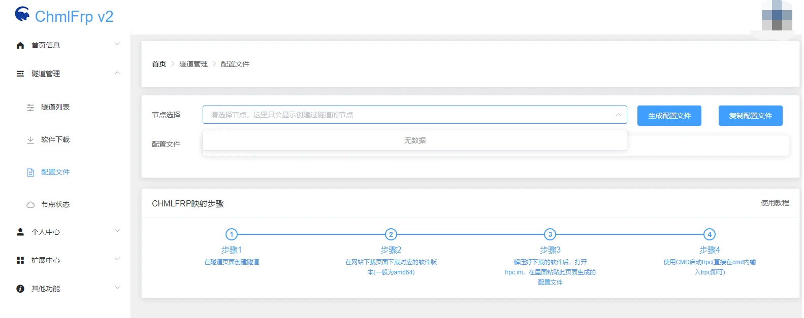

# 网站问题

## 网站重定向次数过多

网站SSL(安全套接字层)或CDN(内容分发网络)的锅，可以尝试清除浏览器cookie，或更换浏览器。
- [edge清除教程](https://support.microsoft.com/zh-cn/microsoft-edge/%E5%9C%A8-microsoft-edge-%E4%B8%AD%E5%88%A0%E9%99%A4-cookie-63947406-40ac-c3b8-57b9-2a946a29ae09)
- [Chrome清除教程](https://zhuanlan.zhihu.com/p/630070627)
- [360清除教程](https://www.xitongzhijia.net/xtjc/20230629/292417.html)

如果清理或更换浏览器后无法解决，可进群反馈或发送邮件至chaoji@chcat.cn。等待8小时左右也能解决这个问题。

## 502 bad gateway(502报错)

如果网站提示502报错，有以下几种可能：
- 请求端向服务器发送请求由于服务器当前链接太多，导致服务器方面无法给于正常的响应，产生此类报错。
- 请求端的 nginx 返回，通常原因是应用所在机房的 BGP 出口有网络异常。
- 您的访问次数过多，被WAF安全防御系统封禁了您的ip（一般为10~30分钟）

您可以等待30分钟或切换设备访问，如果还是访问不上，那就是web服务器寄了，出现这种问题可进群反馈/发送邮件至chaoji@chcat.cn。

## 403报错

403报错代表服务器禁止了您的访问。以下是可能的原因
- 你的IP被WAF(网站应用防火墙)列入黑名单。
- 您的访问次数过多，被WAF安全防御系统封禁了您的ip（一般为10~30分钟）
- 您访问的网站域名不存在。
- 您访问的目录没有权限
- 以http方式访问需要ssl连接的网址。
- 浏览器不支持SSL 128时访问SSL 128的连接。
- 在身份验证的过程中输入了错误的密码。
- 连接的用户过多，可以过后再试。
- 您可能修改了不正确的hosts

如果您什么东西都没有更改，然后web报502。您可以进群反馈/发送邮件至chaoji@chcat.cn。

## 504报错

504报错大概率为代理或CDN的锅，出现这个错误请检查您的代理软件。如果代理软件没问题，则是服务器的问题。出现这种问题可进群反馈/发送邮件至chaoji@chcat.cn。

## 页面无法正常加载

如果页面无法正常加载 在该显示内容的地方为空白或者压根出不来页面(如下图)  

可尝试多等一会或<kbd>Ctrl</kbd>+<kbd>F5</kbd>来进行强制刷新