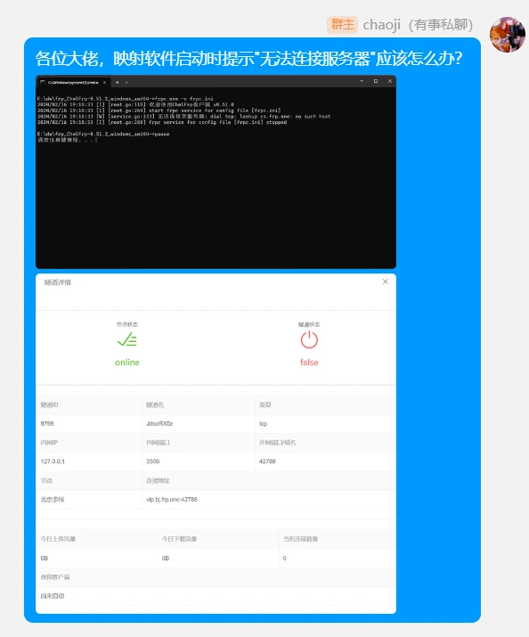

# 提问的艺术

提问也是一门艺术，正确的提问能节省99%的时间，不正确的提问会引来别人的敌对、不满，并且也获取不到自己想要的结果。本篇文档介绍了如何在交流群中正确的提问。

## 提问之前

不管是什么问题，在提问之前您一定要完成以下几点

 - 尝试在网上搜索寻找答案。
 - 尝试通过各大论坛寻找答案。
 - 您已阅读完成官方文档，在确定**完全**看完了文档后没找到自己想要的答案。
 - 尝试自己解决问题。
 - 向您身边的高手朋友寻求答案。

任何问题解决都是需要时间，不要指望通过几秒钟的搜索就能找到答案。在以上操作完成皆无果时我们才推荐您考虑去交流群内寻求答案。

## 怎么提问

提问时，您应该放平心态耐心等待。社区群中不是每个人的时间都是有限的，也不是每个人都熟知您所提问的那个领域，道德绑架、态度差的人往往都得不到好的结果。

在提问时，您需要准备这些

 - 详细的问题描述
 - 完整的截图
 - 完整的日志(如有)
 - 合适的态度(非常重要)

### 正确的提问示例：

### 错误的提问示例：

**无意义的问题**

**什么信息都没提供**

**不看文档/教程，直接提问**

**无营养的问题(指很基础的问题)**

## 可能遇到的问题

在社区群提问题很容易遇到没人理、不友好的回答等情况，这种情况是常见的，您需要提前做好心理准备。

**不友好的回答**

除此之外，还会出现错误的回答这类信息，请注意鉴别

**错误的回答**

注意！在提问时请不要暴露您的个人隐私等数据，如Token(用户密匙)。如果您不小心暴露了Token(用户密匙)，可前往"ChmlFrp控制面板->个人中心->用户信息"中右侧的"重置Token"进行重置Token操作(重置了Token之后已经启动的隧道需要重新获取配置文件)。

------------

此文档用到的截图均为**示例**，图片中的人员均为**演员**，切勿当真。