# 飞牛OS 端口映射教程

本教程将指导您在飞牛OS系统中使用ChmlFrp进行端口映射，以飞牛OS网页服务为例，但同样适用于其他服务的外网端口映射。

## 前置条件

在开始之前，请确保您已具备以下条件：

- ✅ 已注册ChmlFrp账号并登录控制台
- ✅ 飞牛OS系统已安装并正常运行
- ✅ 飞牛OS系统已安装Docker（系统默认已安装）
- ✅ 了解飞牛OS的基本操作

## 第一步：创建隧道

### 1.1 进入隧道管理页面

1. 登录 [ChmlFrp控制台](https://panel.chmlfrp.cn)
2. 在左侧菜单中点击"隧道列表"
3. 点击【添加隧道】按钮

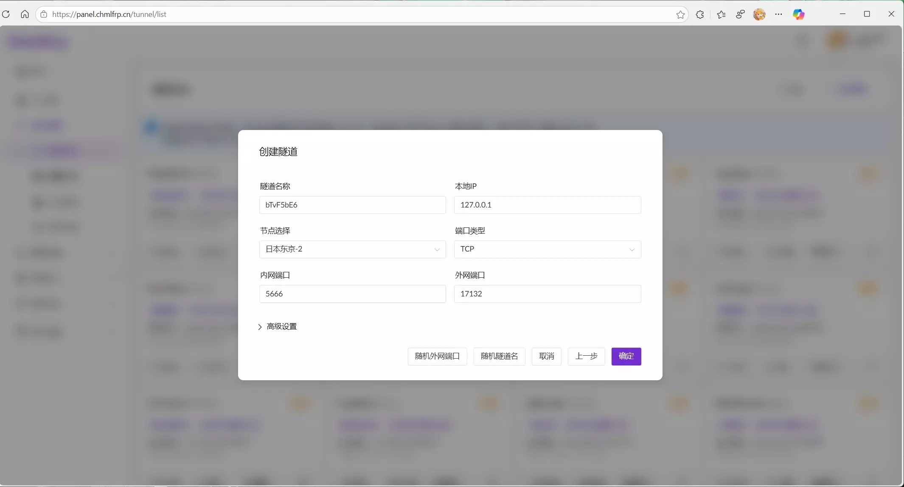

### 1.2 配置隧道参数

根据您的需求与网络状况选择一个合适的节点，并填写以下信息：

- **隧道名称**：自定义名称（这里您可以随意填写，如：fnOS-web）
- **本地地址**：`127.0.0.1`（也可以填写您的fnOS的局域网IP）
- **本地端口**：`5666`（飞牛OS默认端口）

> **💡 端口说明**  
> 飞牛OS的默认服务端口是 5666。如果您的飞牛OS实例修改过此端口，请务必在配置时填写实际的端口号。

### 1.3 完成创建

信息填写完成后点击"确定"，隧道即创建完成。

## 第二步：配置Docker环境

### 2.1 下载frpc镜像

1. 在飞牛OS桌面点击 **Docker** 图标打开Docker管理界面
2. 在左侧菜单中选择"镜像仓库"
3. 搜索并选择 **fatedier/frpc** 镜像
4. 点击"下载"，镜像标签选择 **0.51.2**
5. 点击"确定"并等待镜像下载完成

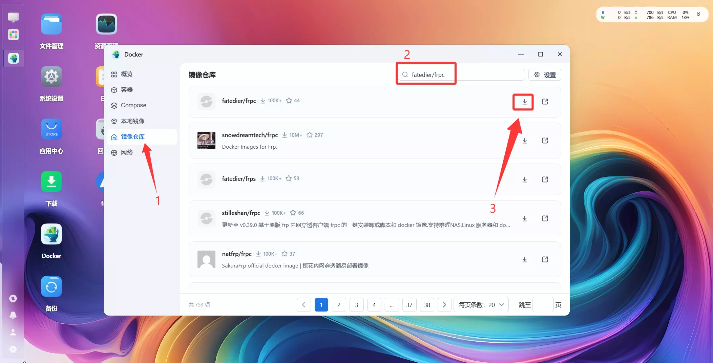
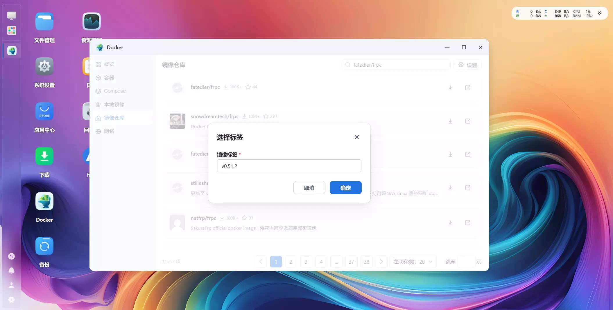

### 2.2 创建配置目录

1. 打开飞牛OS文件管理器
2. 创建一个新文件夹用于存放ChmlFrp配置文件（如：`chmlfrp-jp`）

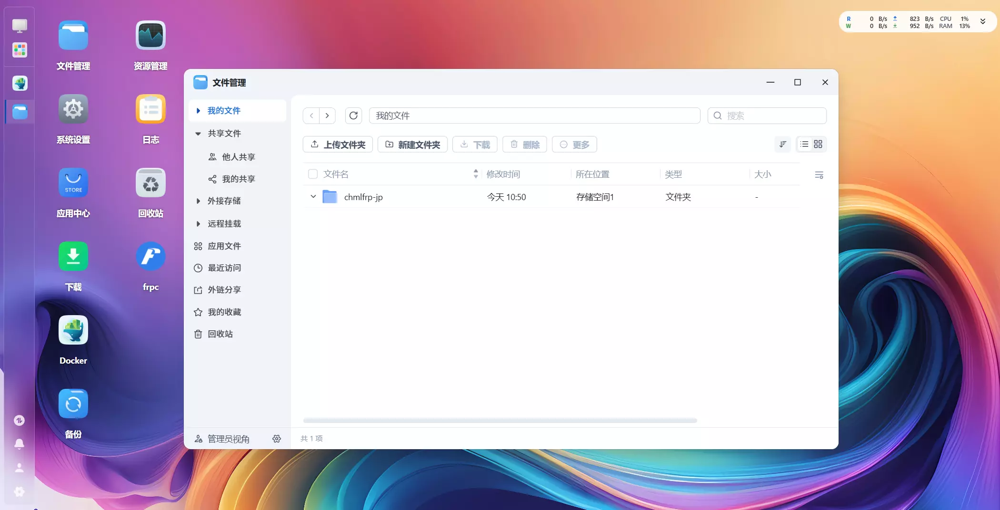

## 第三步：获取并配置frpc配置文件

### 3.1 创建配置文件

在您的电脑上创建一个配置文件：

1. 创建一个名为 `frpc.ini` 的文件（文件的命名可以选择自己想要的，这里以frpc.ini为例）
2. 使用文本编辑器（如记事本）打开该文件

> **💡 提示**  
> Windows系统默认不显示文件扩展名，您需要在文件资源管理器中开启"显示文件扩展名"选项。

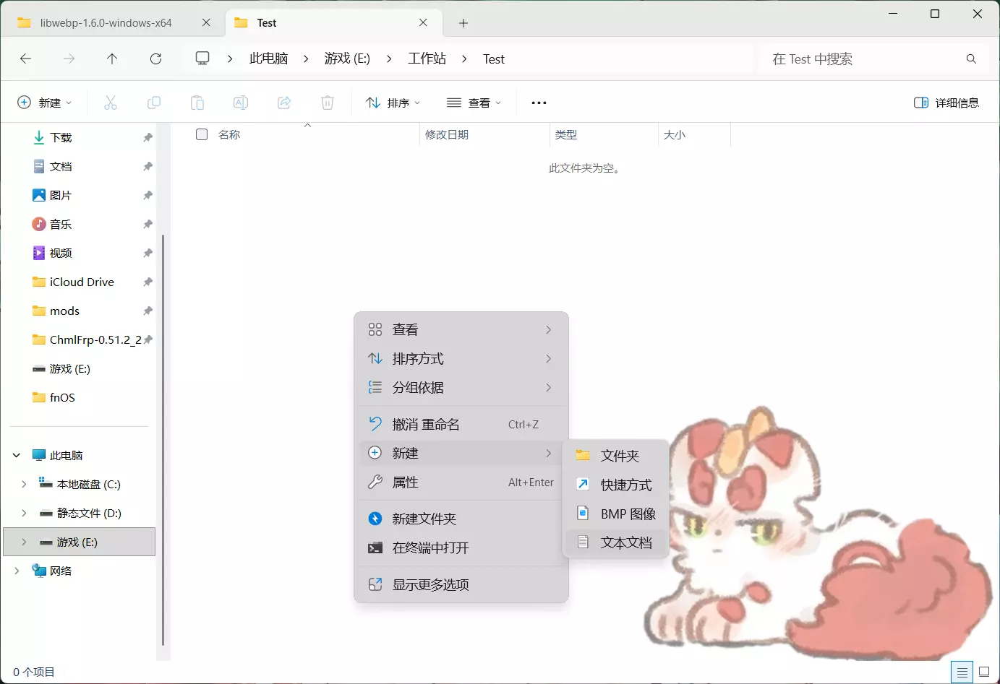
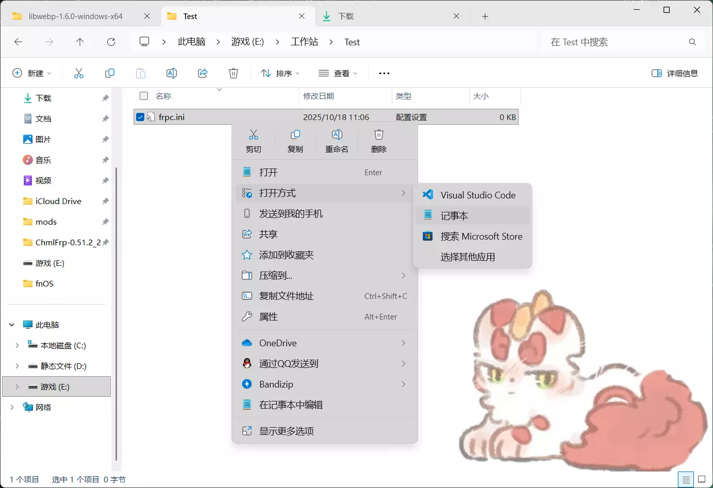

### 3.2 获取配置代码

1. 返回ChmlFrp控制台的"隧道列表"页面
2. 找到您创建的隧道，点击旁边的 **🔧扳手** 扳手图标按钮
3. 在弹出的菜单中选择"获取配置代码"
4. 展开 `frpc.ini` 配置内容
5. 点击"复制配置"按钮

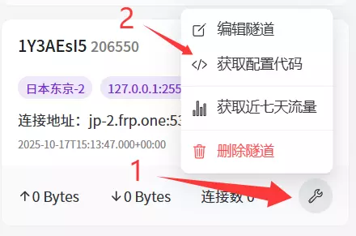

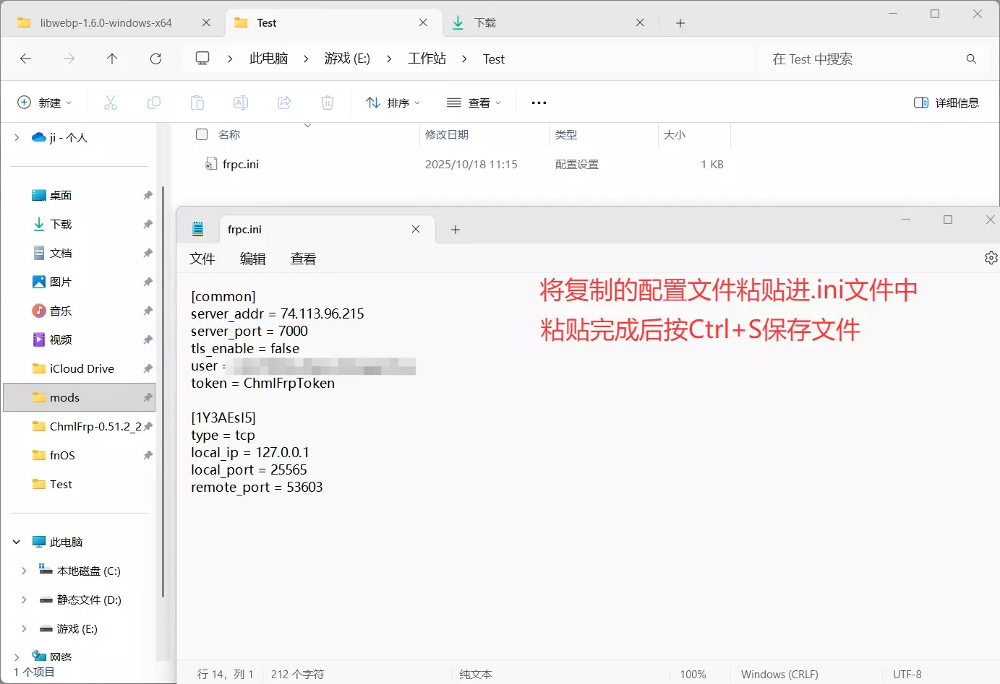

### 3.3 保存配置文件

1. 将复制的配置内容粘贴到 `frpc.ini` 文件中
2. 按 **Ctrl+S** 保存文件
3. 将保存好的 `frpc.ini` 文件上传到飞牛OS中创建的配置目录

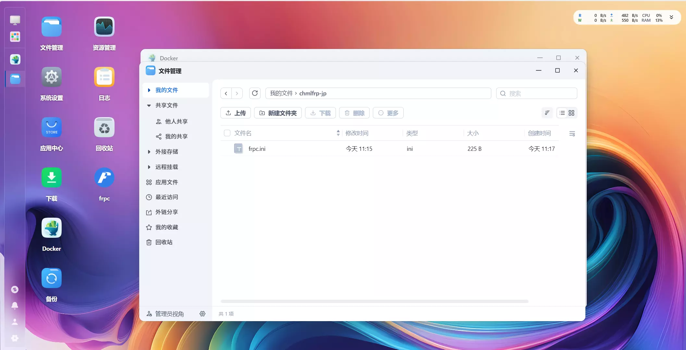

## 第四步：创建并启动Docker容器

### 4.1 创建容器

1. 打开Docker管理界面，选择"本地镜像"
2. 选择之前下载的 **fatedier/frpc** 镜像
3. 点击"创建容器"并配置以下参数：

| 配置项 | 设置值 |
|--------|--------|
| **存储位置** | 选择之前创建的配置目录 |
| **装载路径** | `/conf` |
| **网络模式** | `host` |
| **启动命令** | `-c /conf/frpc.ini` |

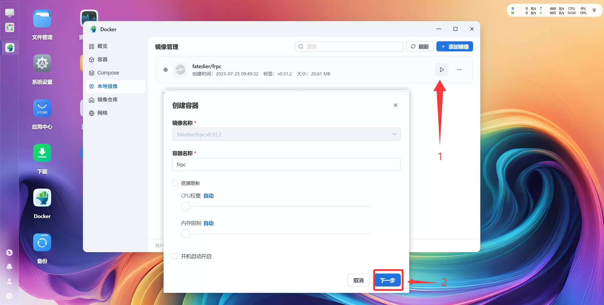
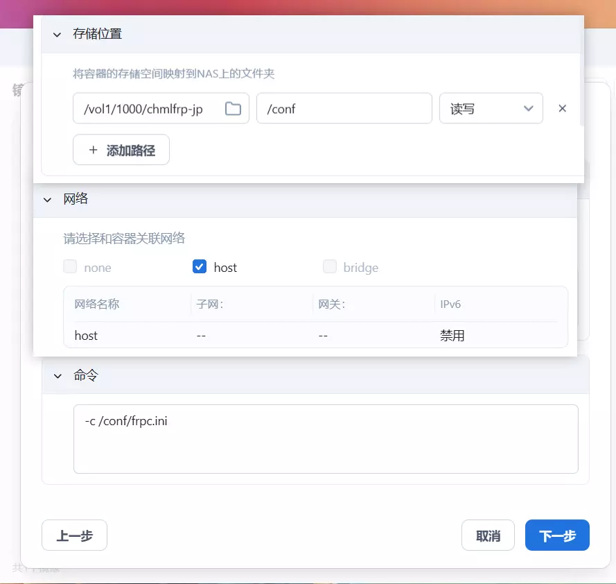

### 4.2 启动容器

1. 在Docker的"容器"菜单中找到刚创建的容器
2. 点击"启动"按钮启动容器

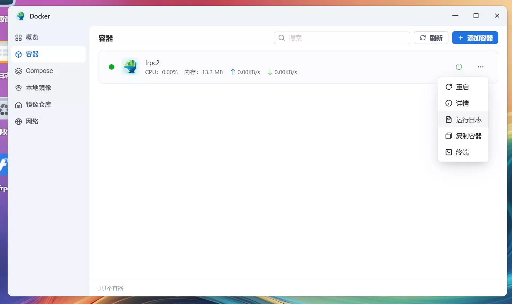

### 4.3 验证启动状态

1. 点击容器的"日志"按钮查看运行状态
2. 如果日志中显示 **start proxy success**，说明隧道启动成功

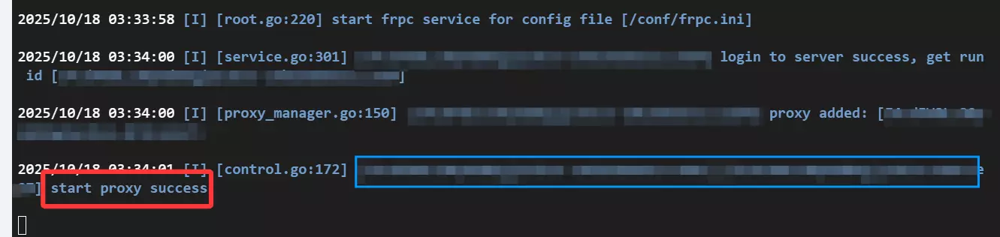

## 第五步：访问服务

隧道启动成功后，您可以通过以下方式访问飞牛OS：

1. 返回ChmlFrp控制台的"隧道列表"页面
2. 点击隧道对应的"连接地址"（点击会自动复制到剪贴板）
3. 在浏览器中粘贴地址即可访问您的飞牛OS服务

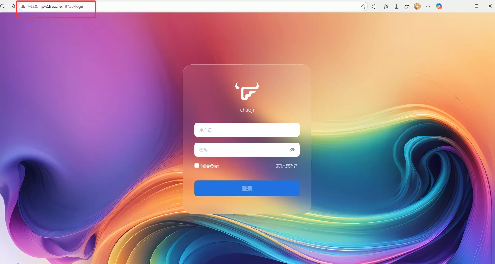

## 故障排除

### 常见问题

**Q: 无法访问外网地址？**  
A: 请确认：
- 隧道状态显示为"在线"
- 本地服务（飞牛OS）正在运行
- 防火墙没有阻止相关端口

**Q: 配置文件格式错误？**  
A: 请确保：
- 配置文件使用UTF-8编码保存
- 没有多余的空格或特殊字符
- 配置内容完整且格式正确

### 获取帮助

如果遇到其他问题，您可以：
- 查看ChmlFrp官方文档
- 联系技术支持
- 在社区论坛寻求帮助