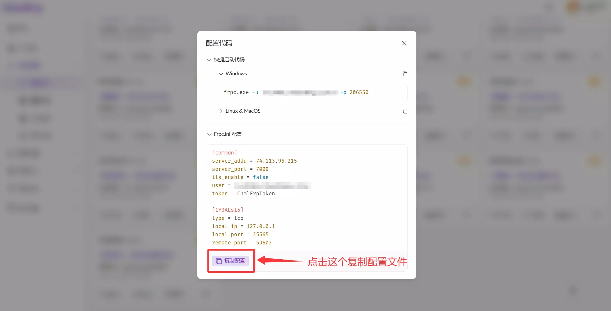

# 飞牛OS启动映射教程

本教程虽以映射飞牛OS网页为例，但同样适用于其他服务的外网端口映射。操作时，您仅需将教程中的端口号替换为您实际需要的端口。

## 创建隧道

1. 首先，请进入 ChmlFrp 控制台的“隧道列表”页面。
2. 然后，点击【添加隧道】按钮，并根据您的需求与网络状况选择一个合适的节点。

**端口说明：** 飞牛OS的默认服务端口是 5666。如果您的飞牛OS实例修改过此端口，请务必在配置时填写实际的端口号。

信息填写完成后点击"确定"，隧道即创建完成。

## 启动隧道

### 配置Docker环境

1. 打开Docker（飞牛OS系统默认已安装 Docker，在桌面点击 Docker 图标即可）
2. 在打开的Docker菜单中，选择"镜像仓库"，然后搜索 **fatedier/frpc**
3. 点击下载后，镜像标签选择 **0.51.2** 最后点击"确定"
4. 等待镜像下载完成

创建容器之前，需要先前往文件管理页面创建一个存放ChmlFrp配置文件的目录。命名可以随意，这里以chmlfrp-jp为示例。

随后在另外的系统内，创建一个后缀为ini的文件，文件名这里以frpc为例。（注意，Windows默认不会显示后缀，您需要开启后缀显示才能看见）

随后通过自己喜欢的编辑器打开这个文件，这里以记事本为例。

现在执行以下步骤：
1. 返回ChmlFrp 控制台的“隧道列表”页面。
2. 点击您创建的隧道旁边的小扳手
3. 在弹出的菜单内，点击"获取配置代码"
4. 把Frpc.ini的内容展开，然后点击"复制配置"
5. 将复制的配置文件填写进刚刚创建的ini文件中，然后按键盘上的 **Ctrl+S** 保存文件

将保存好的ini文件上传至进我们之前在飞牛OS中创建的文件夹内。

1. 随后打开桌面的Docker，在左侧菜单中选择"本地镜像"，在本地镜像中选择之前下载好的 **fatedier/frpc** 镜像。
2. 按照自己的需求填写完成信息后点击下一步
3. 存储位置的路径选择我们之前创建的存放ini文件的文件夹，然后装载路径填写 **/conf** 、网络选择host、命令填写 **-c /conf/frpc.ini**
5. 确认容器信息无误后点击"创建容器"

最后！前往Docker中的容器菜单，启动刚刚创建的容器。

如果没有启动失败就查看运行日志，如果日志中存在**start proxy success**字样，则代表隧道启动成功！

此时，您就可以通过 ChmlFrp 控制台的“隧道列表”页面 的连接地址访问（点一下连接地址会自动复制到剪切板）

