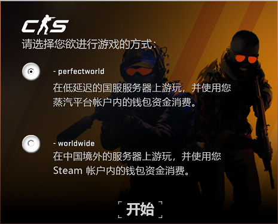
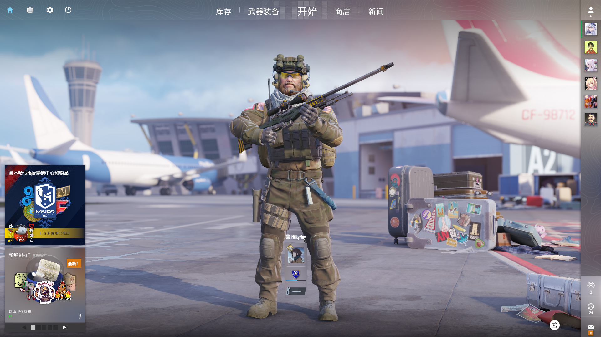
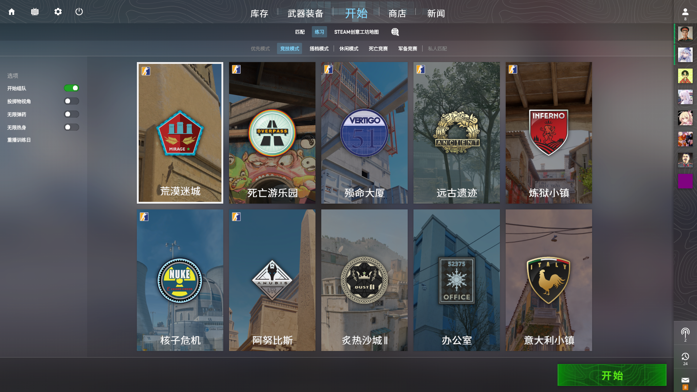
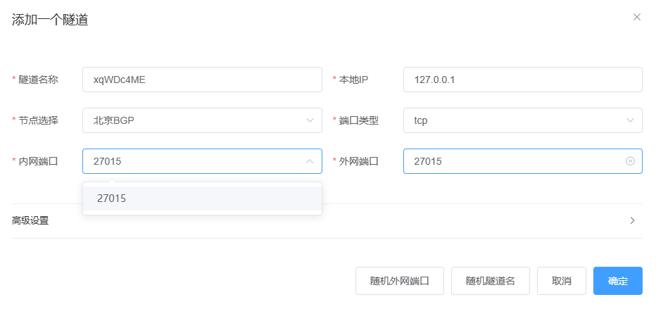
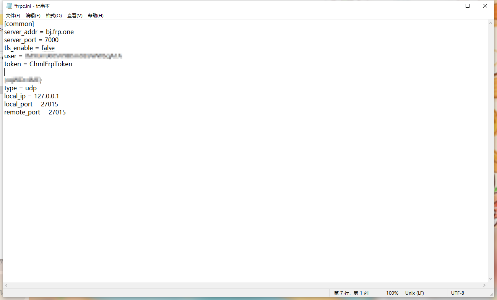
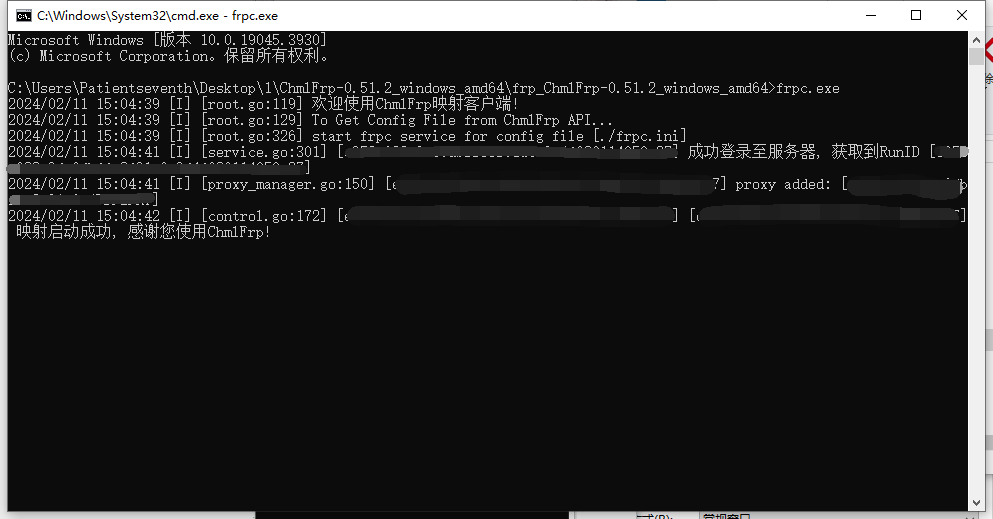
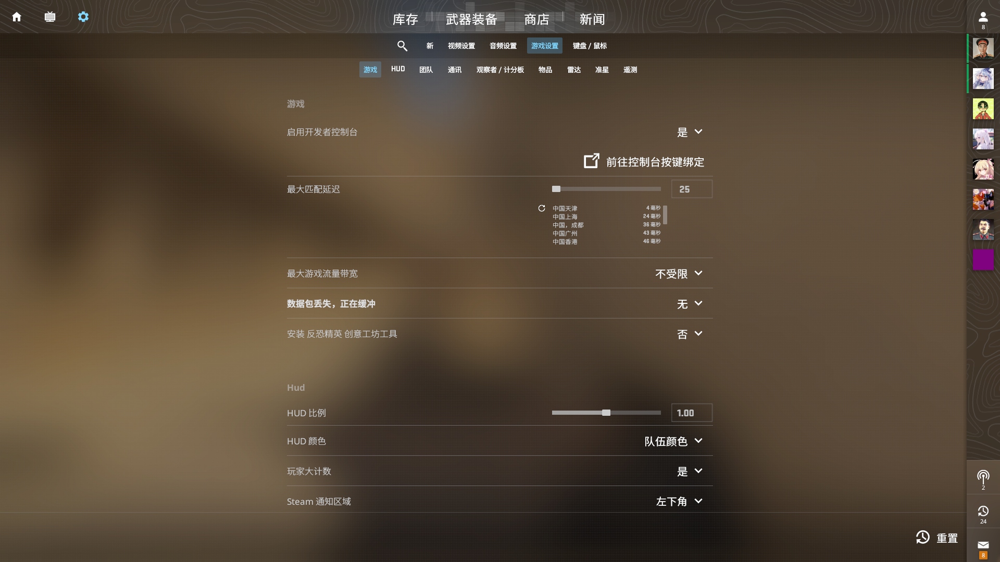
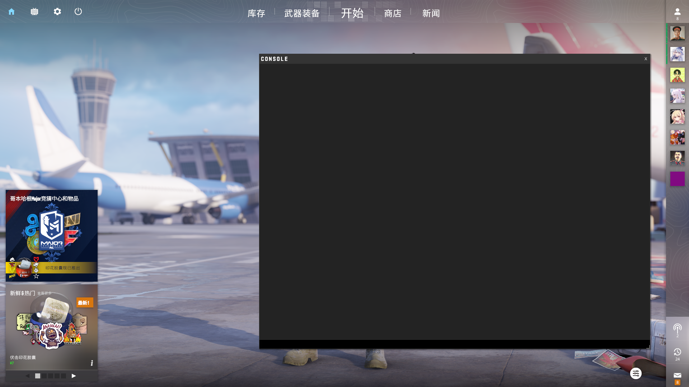
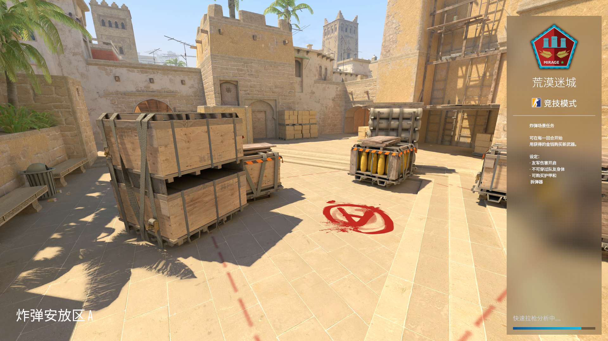

# CS2联机教程

本教程适用于想打内战，不想用平台，想和朋友玩创意工坊的玩家
由于不知道V社的BUG还是故意为之 目前CS2无法像CSGO通过机器人训练赛直接联机

---

## 房主端：

启动steam，登陆账号并进入游戏(想打创意工坊的话可以用国际服，其他的国服国际都行)





打开 "练习" 选择地图



点击右下角开始 ~~放置一旁备用~~

访问[chmlfrp官网](https://panel.chmlfrp.cn)

进行创建隧道

[创建隧道教程文档](../use/mapping)

选择一个离你服务器近的节点

将内网端口改为27015（V社默认联机端口） 外网端口随意

协议使用UDP



在服务器中部署chmlfrp软件并更改frpc.ini文件



启动映射程序

等待映射启动完毕



恭喜你 创建完了属于自己的CS2房间

## 客户端：

启动steam，登陆账号并进入游戏


在 **各项设置页面** 页面选择 **启用开发者控制台** 为 **是**



在主页面点击<kbd>`</kbd>(tab上面辣个 注意要英文状态点击) 呼出控制台



输入

```shell
connect [IP:端口]
```

注：[IP：端口]是让你输入房主FRP的IP端口 不是让你照搬
回车 即可进入房间

