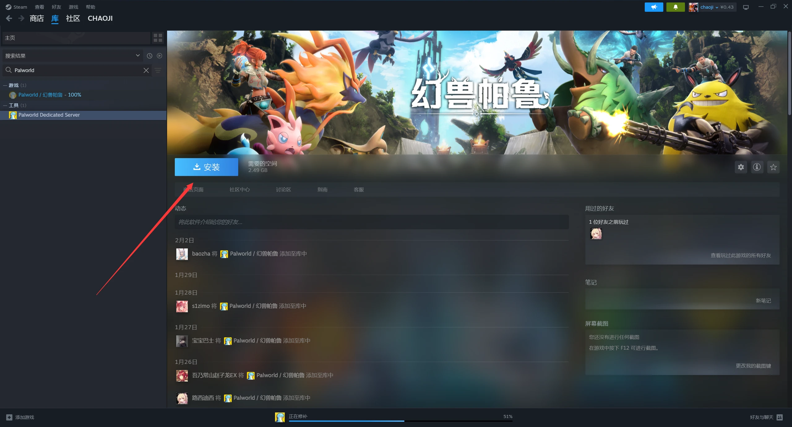
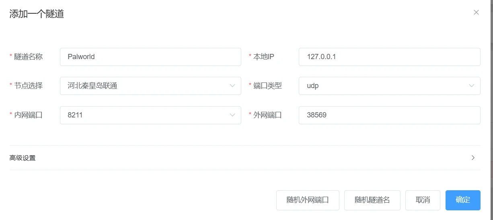
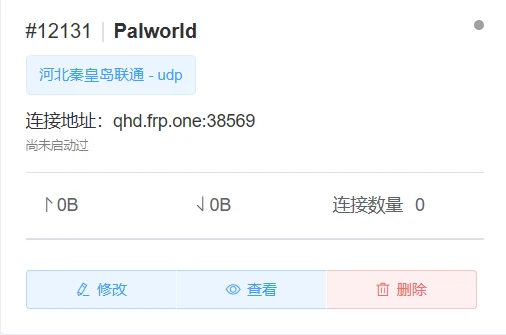
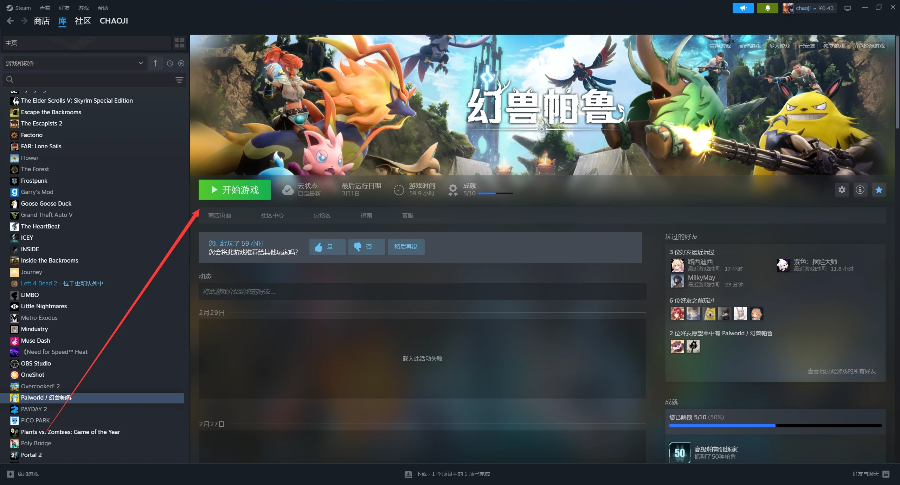
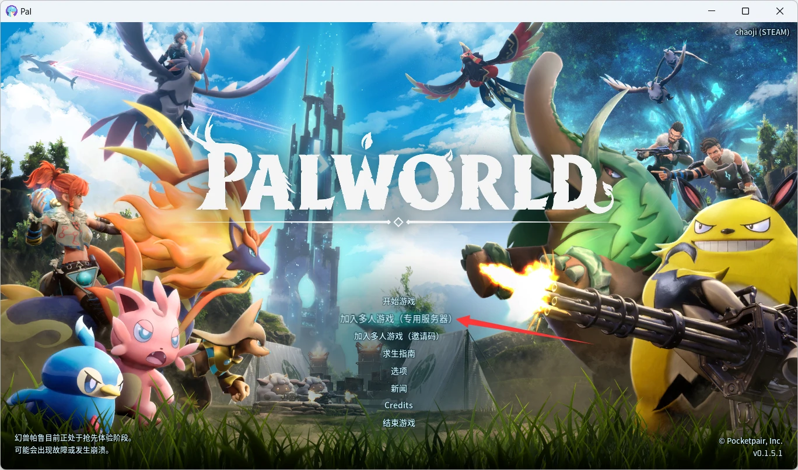
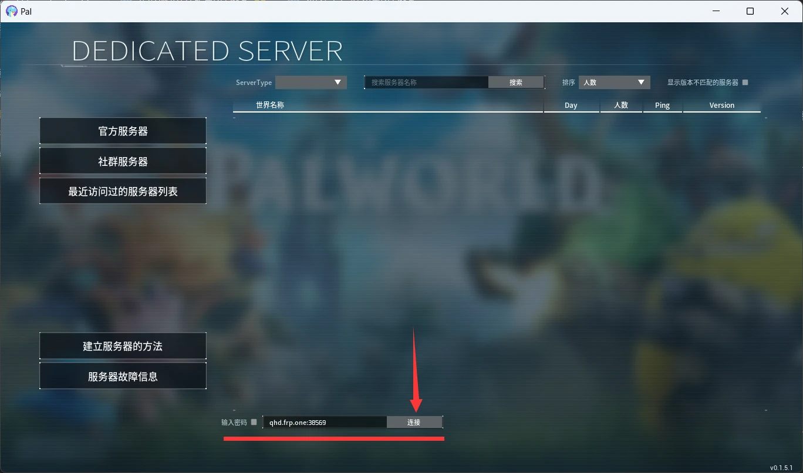

# 幻兽帕鲁开服教程

此开服教程以steam正版幻兽帕鲁为例，需要您的steam拥有幻兽帕鲁

## 开服者

打开Steam，进入到 库->主页 ，在搜索框中搜索"Palworld"，在"工具"分类栏中选择"Palworld Dedicated Server"(这个为幻兽帕鲁服务端)，然后启动(未安装的需要点击安装)。

启动好幻兽帕鲁服务端(Palworld Dedicated Server)后创建并启动ChmlFrp隧道。[点击跳转到映射使用教程](../use/mapping)

创建隧道时内网端口填写8211，端口类型选择UDP。**此端口为幻兽帕鲁默认端口，改了配置文件的话需填写更改的端口**。

根据[ChmlFrp基础教程](../use/mapping)启动好隧道后，即可通过连接地址进入游戏。

## 玩家

打开Steam，进入到 库->主页 ，找到幻兽帕鲁(Palworld)游戏，点击"开始游戏"(未安装的需要点击安装)

等待游戏加载完成进入主页面后，点击"加入多人游戏(专用服务器)"

进入到DEDICATED SERVER页面后，在下方的地址框中输入ChmlFrp隧道提供的"连接地址"，然后点击"连接"即可。(此处填写的qhd.frp.one:38569为示例)

