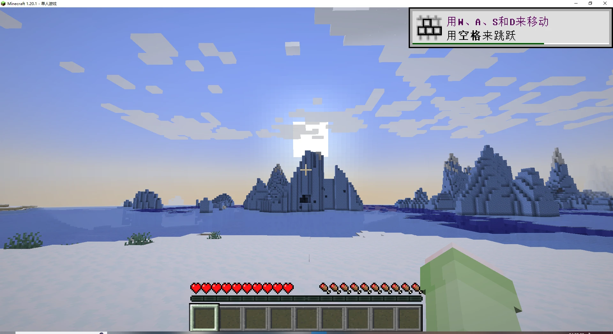
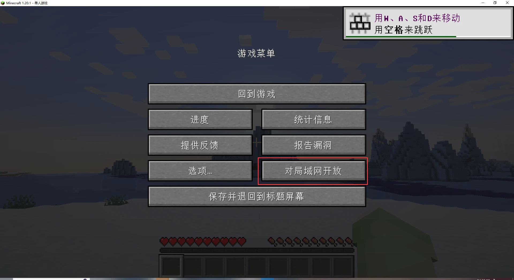
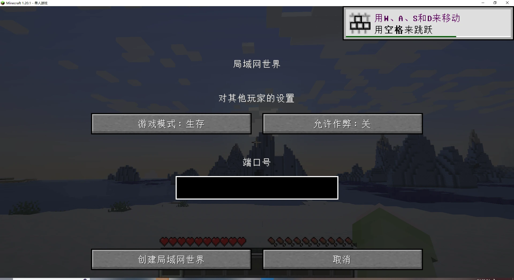
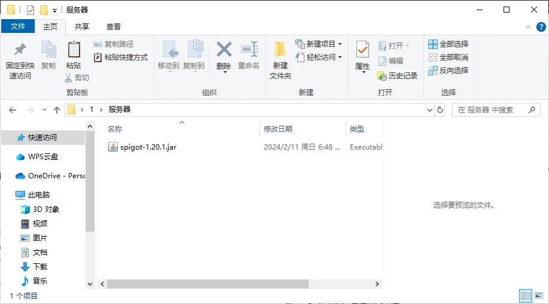
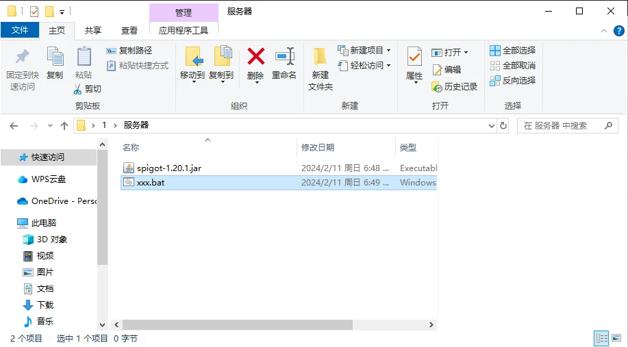
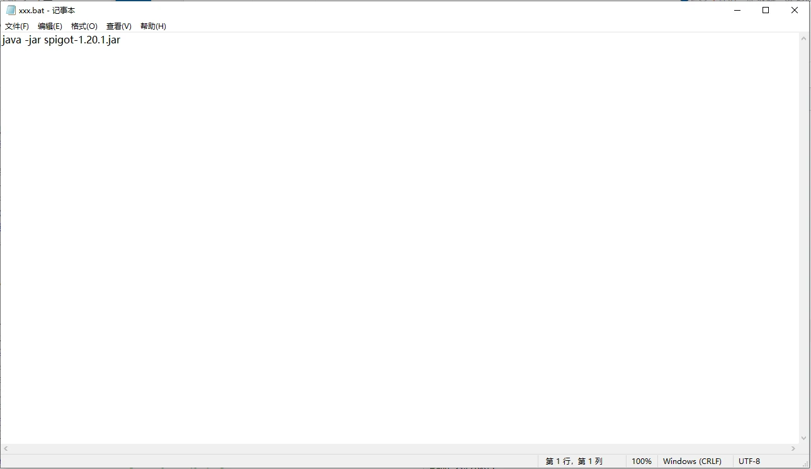
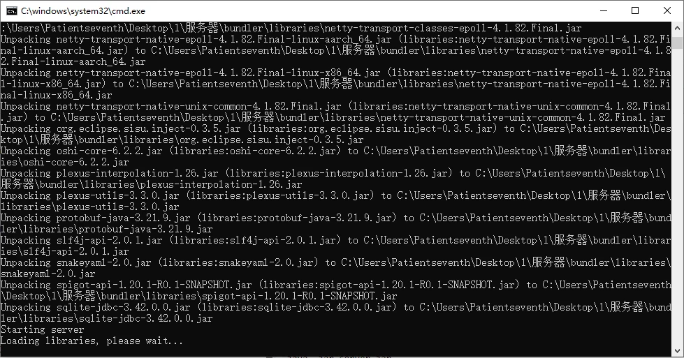
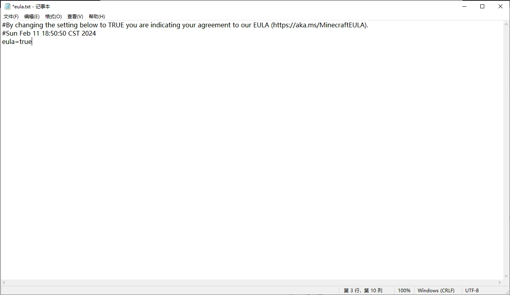
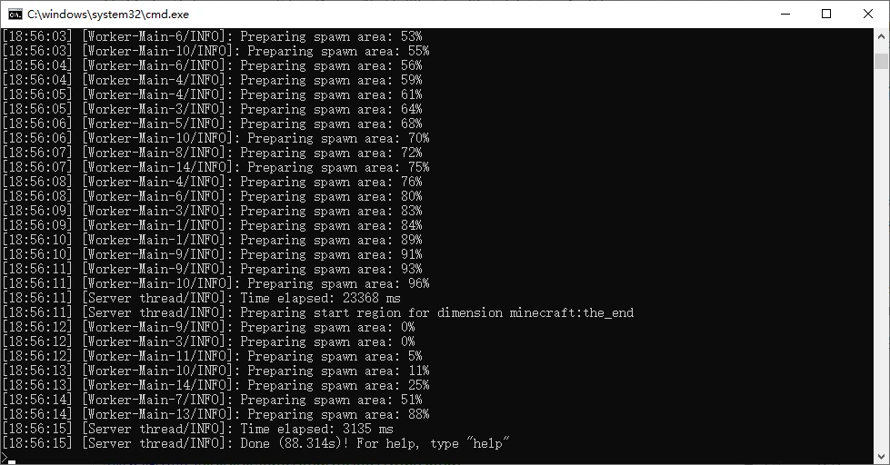

# 我的世界联机教程

本教程将指导您如何设置我的世界（Minecraft）的局域网联机和服务器联机，包括本地联机和远程联机的完整配置方法。

## 前置条件

在开始之前，请确保您已具备以下条件：

- ✅ 已安装我的世界Java版客户端
- ✅ 已注册ChmlFrp账号并登录控制台
- ✅ 了解基本的网络概念（端口、IP地址等）
- ✅ 对于服务器联机，需要安装Java运行环境

## 第一部分：局域网联机教程

### 1.1 开启局域网游戏

1. **进入游戏存档**
   - 启动我的世界客户端
   - 选择您要联机的存档并进入游戏



2. **打开游戏菜单**
   - 按键盘上的 **ESC** 键打开游戏菜单
   - 点击"对局域网开放"选项



3. **配置局域网设置**
   - 设置游戏模式（生存/创造/冒险等）
   - 选择是否允许作弊
   - 设置端口号（1.20版本后支持自定义端口）



4. **确认配置**
   - 检查所有设置无误后点击"开始局域网世界"


5. **验证开启状态**
   - 当看到"本地游戏已在端口**[端口号]**上开启"的提示时，说明局域网游戏已成功开启


### 1.2 局域网内连接

局域网内的其他玩家可以通过以下方式加入游戏：

1. 打开我的世界客户端
2. 点击"多人游戏"
3. 在服务器列表中会自动显示您的局域网服务器
4. 双击服务器名称即可加入游戏

### 1.3 远程联机设置

如果想让异地的朋友也能加入游戏，需要使用端口映射：

1. **创建隧道**
   - 登录 [ChmlFrp控制台](https://panel.chmlfrp.cn)
   - 创建新隧道，内网端口填写游戏显示的端口号
   - 隧道类型选择 **TCP**

2. **启动隧道**
   - 按照 [映射教程](../use/mapping) 启动隧道
   - 获取外网连接地址

3. **分享连接信息**
   - 将外网连接地址分享给朋友
   - 朋友在多人游戏中添加服务器，输入连接地址即可

> **⚠️ 重要提示**  
> 通过映射联机时，只有正版MC用户才能进入服务器，离线账户无法连接。解决方案：
> - 使用[自定义局域网联机模组](https://www.mcmod.cn/class/2754.html)关闭正版验证
> - 所有玩家使用外置登录（如：[LittleSkin](https://littleskin.cn)、[RedstoneSkin](https://mcskin.cn)）
> - 搭建专用服务器（见下方服务器教程）

## 第二部分：服务器联机教程

### 2.1 选择服务端

首先，您需要选择一个适合的服务端。以下是常用的服务端类型：

| 服务端类型 | 特点 | 适用场景 | 下载地址 |
|-----------|------|----------|----------|
| **官方原版端** | 纯净无插件 | 原版体验 | [官方下载](https://www.minecraft.net/zh-hans/download/server) |
| **Spigot** | 支持插件 | 小型服务器 | [Spigot官网](https://getbukkit.org/) |
| **Paper** | 优化性能 | 中大型服务器 | [Paper官网](https://papermc.io/) |
| **CatServer** | 支持插件+模组 | 模组服务器 | [CatServer官网](https://catmc.org/) |
| **Mohist** | 支持插件+模组 | 混合服务器 | [Mohist官网](https://mohistmc.com/) |

> **💡 推荐选择**  
> - 新手用户：选择官方原版端或Spigot
> - 需要插件：选择Spigot或Paper
> - 需要模组：选择CatServer或Mohist

### 2.2 下载和准备服务端

1. **下载服务端文件**
   - 访问上述任一服务端官网
   - 下载对应版本的jar文件（如：`server.jar`）

2. **创建服务器目录**
   - 在您的电脑上创建一个新文件夹
   - 将下载的jar文件放入该文件夹



### 2.3 创建启动脚本

1. **创建批处理文件**
   - 在服务器文件夹中新建一个文本文件
   - 将文件重命名为 `start.bat`（或任意名称.bat）



2. **编写启动脚本**
   - 右键点击bat文件，选择"编辑"
   - 输入以下代码：

```batch
java -jar server.jar
pause
```

**参数说明：**
- `java`：Java运行环境路径（如果已配置环境变量可直接使用）
- `server.jar`：您的服务端文件名
- `pause`：运行结束后暂停，便于查看错误信息



3. **保存并测试**
   - 按 **Ctrl+S** 保存文件
   - 双击运行bat文件



### 2.4 同意EULA协议

首次启动时，服务器会要求您同意EULA协议：

1. **查看错误信息**
   - 当看到以下错误信息时，需要同意EULA协议：

```shell
[ServerMain/INFO]: You need to agree to the EULA in order to run the server. Go to eula.txt for more info.
```


2. **修改EULA文件**
   - 在服务器文件夹中找到 `eula.txt` 文件
   - 用文本编辑器打开该文件
   - 将 `eula=false` 改为 `eula=true`



3. **重新启动服务器**
   - 保存EULA文件后，再次双击运行bat文件



### 2.5 验证服务器启动

当看到以下信息时，说明服务器启动成功：

```shell
[Server thread/INFO]: Done (88.314s)! For help, type "help"
```

此时服务器已准备就绪，可以接受玩家连接。

### 2.6 配置端口映射

为了让外网玩家能够连接您的服务器，需要配置端口映射：

1. **创建隧道**
   - 登录 [ChmlFrp控制台](https://panel.chmlfrp.cn)
   - 创建新隧道，配置如下：
     - **内网地址**：`127.0.0.1`
     - **内网端口**：`25565`（MC默认端口）
     - **隧道类型**：`TCP`

2. **启动隧道**
   - 按照 [映射教程](../use/mapping) 启动隧道
   - 获取外网连接地址

3. **分享服务器信息**
   - 将外网连接地址分享给朋友
   - 朋友在多人游戏中添加服务器，输入连接地址即可

> **💡 端口说明**  
> - MC Java版默认端口：25565
> - 如果修改了服务器端口，创建隧道时请填写实际端口号
> - 可以在 `server.properties` 文件中修改服务器端口（修改server-port=25565中的25565）

## 故障排除

### 常见问题

**Q: 服务器启动失败？**  
A: 请检查：
- Java环境是否正确安装
- 服务端文件是否完整
- 端口是否被其他程序占用

**Q: 玩家无法连接服务器？**  
A: 请确认：
- 隧道状态显示为"在线"
- 服务器正在运行
- 防火墙没有阻止相关端口

**Q: 服务器卡顿或延迟高？**  
A: 建议：
- 使用Paper等优化服务端
- 调整服务器配置参数
- 选择距离较近的节点

### 获取帮助

如果遇到其他问题，您可以：
- 查看ChmlFrp官方文档
- 联系技术支持
- 在社区群寻求帮助