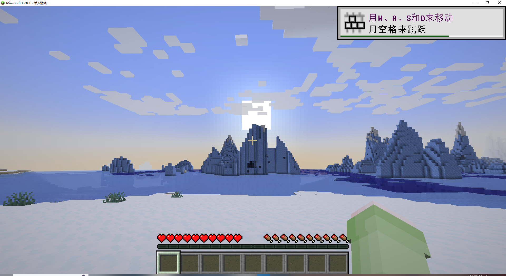
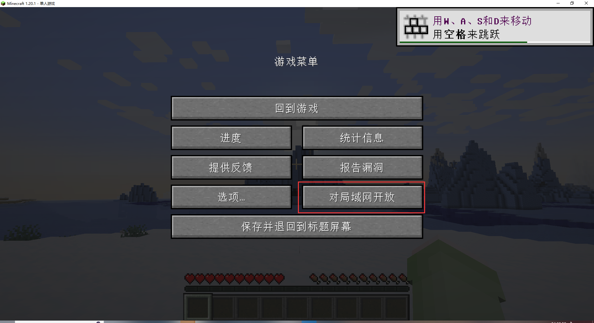
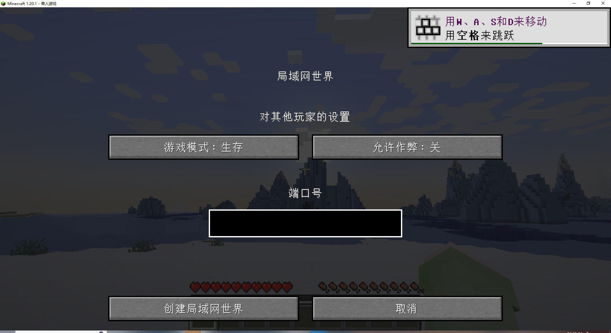
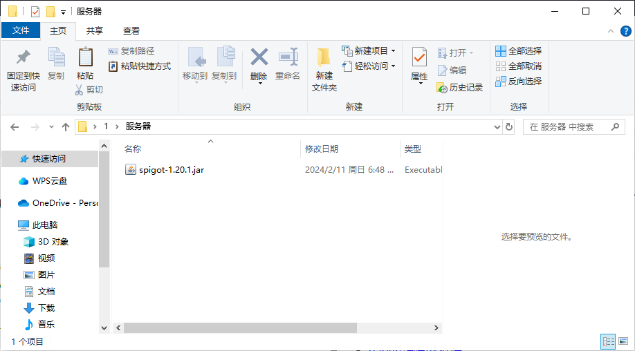
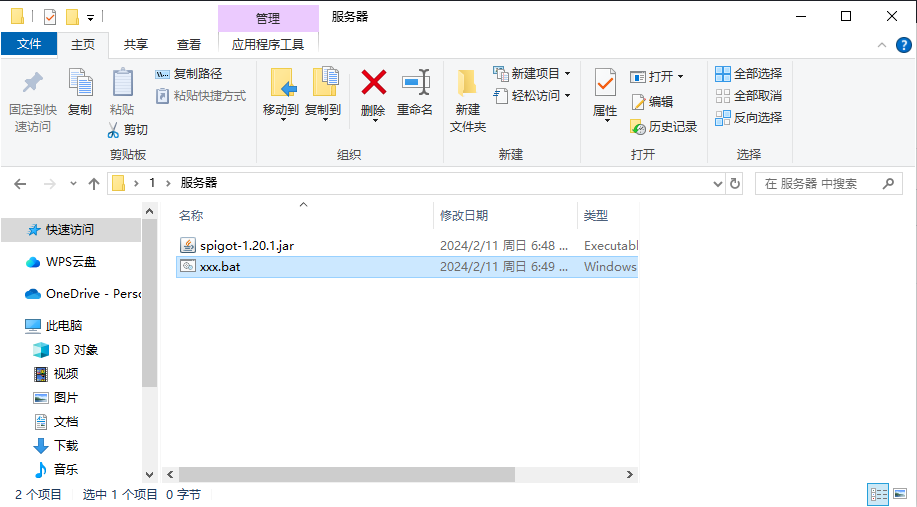
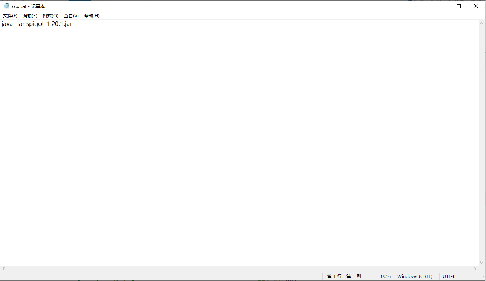
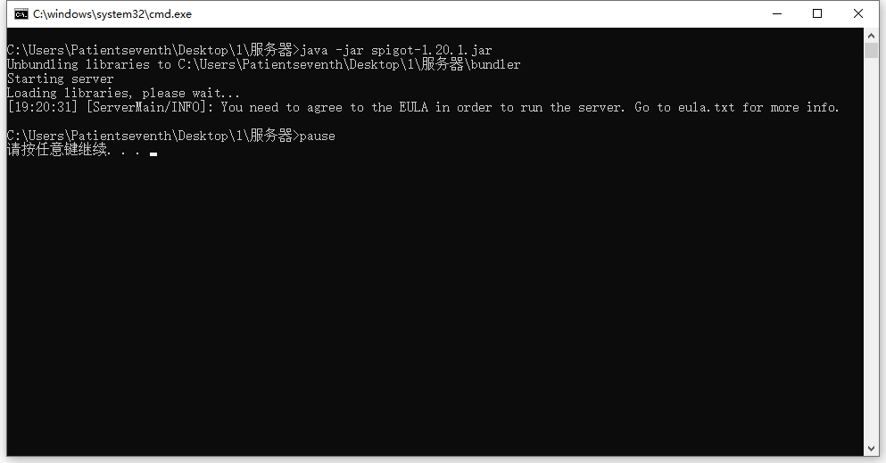
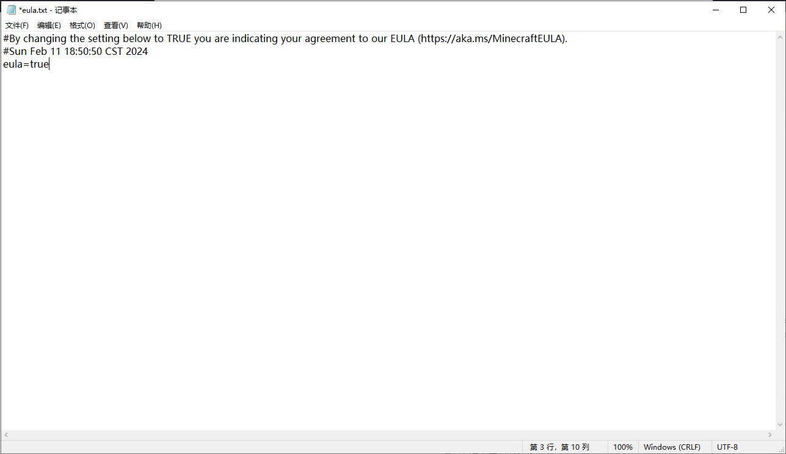

# 我的世界联机教程

## 我的世界客户端局域网联机教程

首先 打开我的世界 进入您要联机的存档



点击键盘上的esc 打开游戏菜单 点击对局域网开放



接下来 设置一下游戏模式 允许作弊 还有端口号吧（自定义端口号在1.20被加入）



就像....这样 ฅ՞•ﻌ•՞ฅ


出现这条就说明 你的世界已经在局域网开放了


到这里局域网(同一个网络)下的玩家已经可以进服务器了，在多人游戏那边能搜索到局域网服务器。**如果想要异地的朋友也能进，则需要使用映射**

映射教程：[传送门](../use/mapping)

映射的内网端口填写"本地游戏已在端口**[12345]**上开启"中的**12345**，类型选择**TCP**。映射成功后朋友即可通过连接地址进入游戏。

**注意！通过映射联机只能正版MC用户才能进入服务器，离线账户连接不上。解决方法有：**
 - 使用[[自定义局域网联机](https://www.mcmod.cn/class/2754.html)]等模组，在对局域网开放时关闭"在线模式"或"正版验证"
 - 所有人均使用外置登录(如：[LittleSkin](https://littleskin.cn/)，[RedstoneSkin](https://mcskin.cn))
 - [开服务端](#我的世界服务器联机教程)，在服务端配置文件中关闭正版验证

------------

## 我的世界服务器联机教程

首先 你得需要一个服务端

服务端的地址：
- [我的世界官方原版端(https://www.minecraft.net/zh-hans/download/server)](https://www.minecraft.net/zh-hans/download/server)
- [spigot(水桶端)插件端(https://getbukkit.org/)](https://getbukkit.org/)
- [paper(纸端)插件端(https://papermc.io/)](https://papermc.io/)
- [catsever(猫服)插件+mod端(https://catmc.org/)](https://catmc.org/)
- [mohist(莫服)插件+mod端(https://mohistmc.com/)](https://mohistmc.com/)

这里就拿水桶端做演示啦

然后把端放在任何一个文件夹里 就像...这样



嗯...你或许还需要一个启动文件

新建一个新建文本文档.txt

将文件重命名为XXX.bat

前面你想起什么名字起什么名字 后缀词改为bat就好啦



然后右键->编辑 里头写上以下代码

```shell
java -jar server.jar
pause
```

java是你的java路径 如果填写"java"会自动寻找环境变量

server.jar是你的核心名字

pause是指结束后不立马关闭cmd 以便于检修



这就是最基本的一个启动项

保存bat文件

然后双击打开

像这样


他就正式开始下载内容了

等他出现这个词条时

```shell
[ServerMain/INFO]: You need to agree to the EULA in order to run the server. Go to eula.txt for more info.
```



证明 你没有同意他的协议 需要你手动打开 EULA.txt

然后把eula改成

```shell
eula=true
```

就像这样


此时再次双击打开bat


当出现

```shell
[Server thread/INFO]: Done (88.314s)! For help, type "help"
```

的时候就说明成功了。

MC java版服务端默认使用的端口为25565，您需要创建隧道时内网端口选择25565，然后启动隧道，就能通过链接地址访问了。如果您更改了默认端口，创建隧道时则需要填您更改的端口。