# 我的世界外置登录教程
## 网页教程

外置登录皮肤站网站  
[LittleSkin - 快速、可靠的公益 Minecraft 皮肤站](https://littleskin.cn/?lang=zh_CN)  
[红石皮肤站 - 免费、自由、快速的 Minecraft 皮肤站 (mcskin.cn)](https://mcskin.cn/)

以[LittleSkin](https://littleskin.cn)为例

首先访问LittleSkin的官网

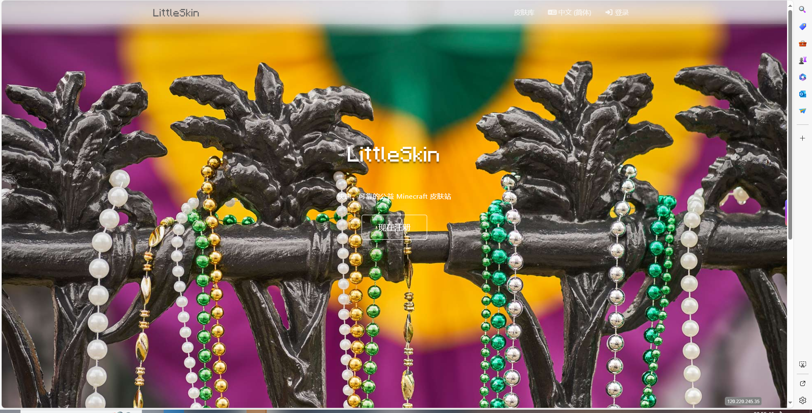

点击屏幕正中央的'现在注册'

输入你的邮箱，密码，想在我的世界里起的名字和验证码

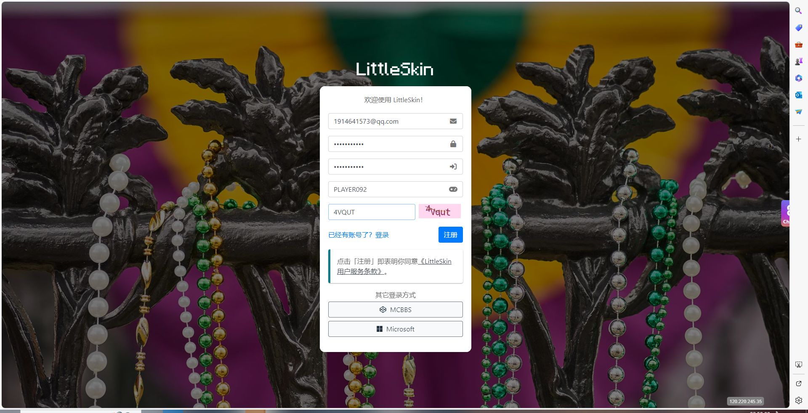

然后根据个人喜好 注册名字，添加皮肤等
（注意：皮肤名字不可以跟正版，外置重复）

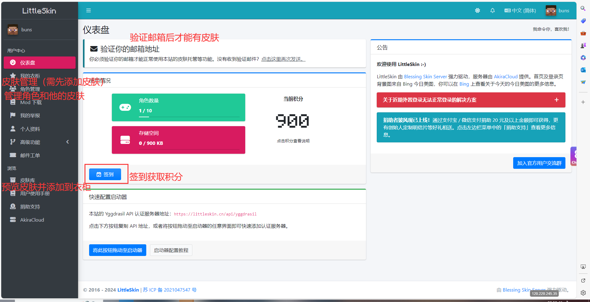

## 启动器教程

[HMCL官方下载地址](https://hmcl.huangyuhui.net/download/)  
[PCL2官方下载地址](https://afdian.com/p/0164034c016c11ebafcb52540025c377)

这里拿HMCL举例

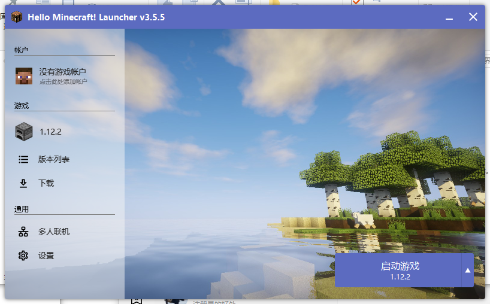

点击左上角的 **没有游戏帐户**

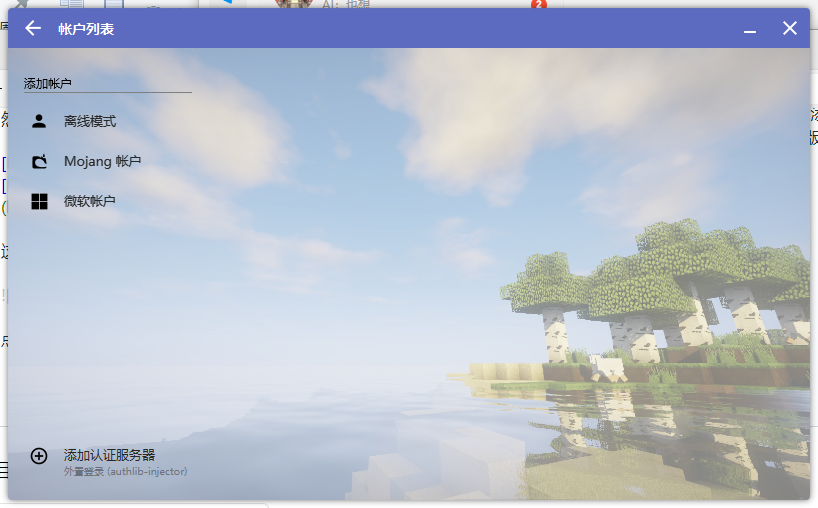

点击左下角的 **添加认证服务器**

输入皮肤站的官网地址
比如littleskin就是

```shell
https://littleskin.cn/
```


点击下一步  
这里会让您确认是否是这个认证服务器

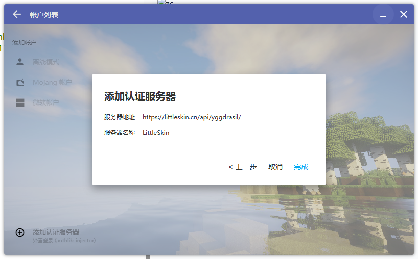

如果无误就可以点击完成  
此时 左边登录选项应该会多出一个 **LittleSkin**

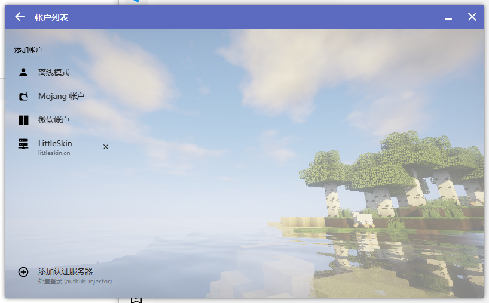

点击 **LittleSkin**
输入注册时所用的邮箱和密码

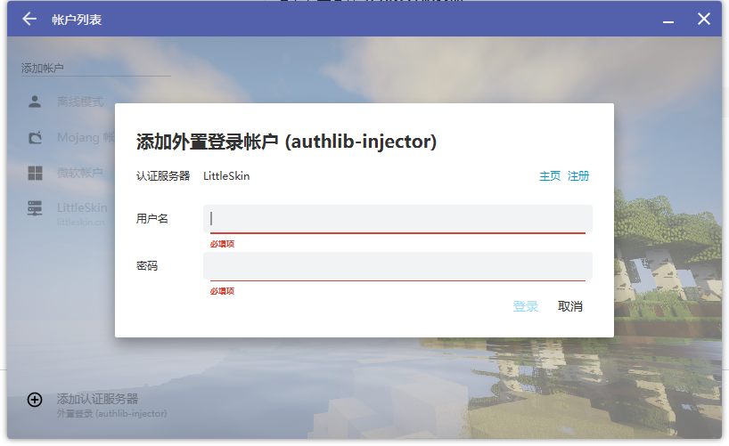

注意：此步需要先验证邮箱 否则就会....

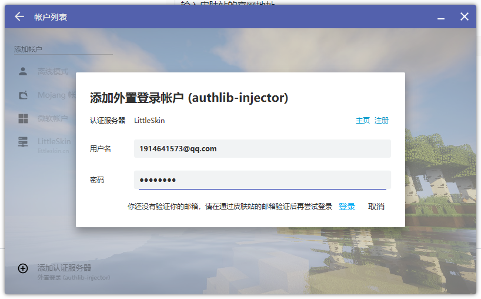

如果验证邮箱正常成功登录后
就会让你选择角色

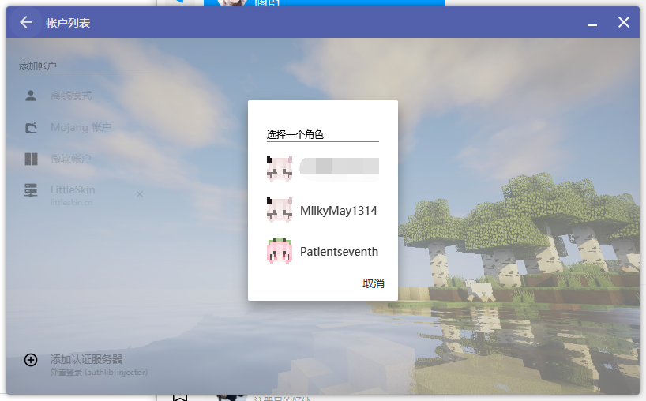

点击你所想要的角色即可  
然后就可以正常游玩了

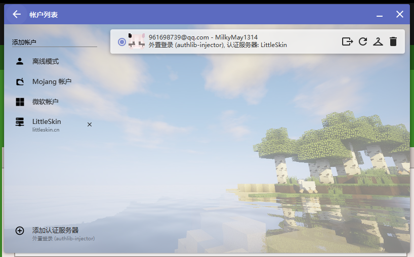