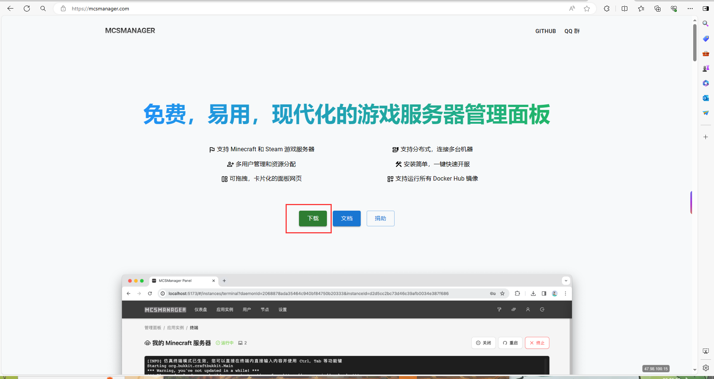
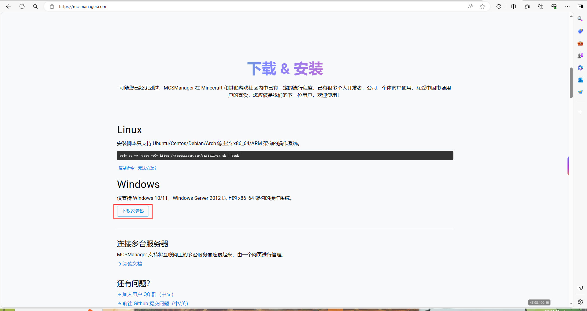
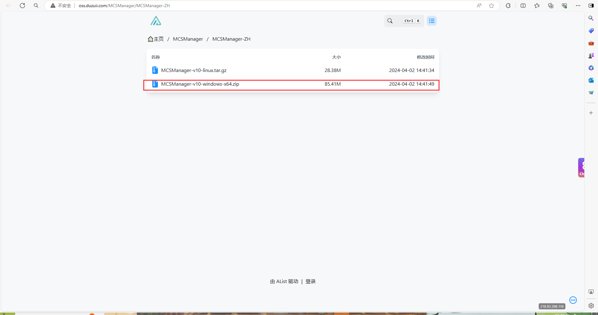
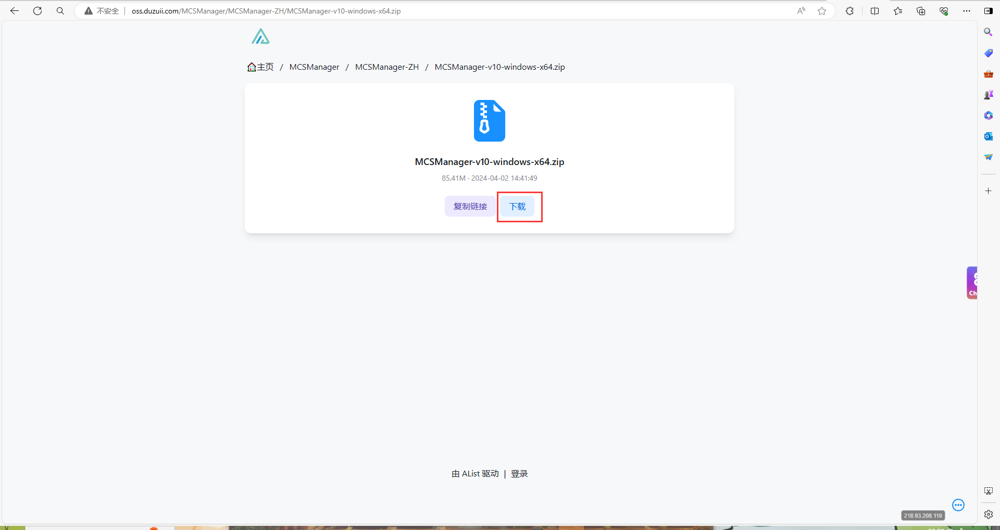
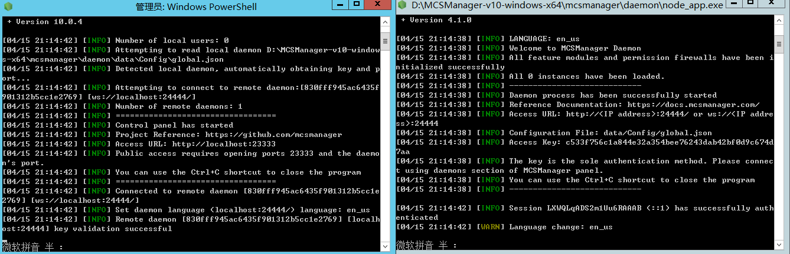
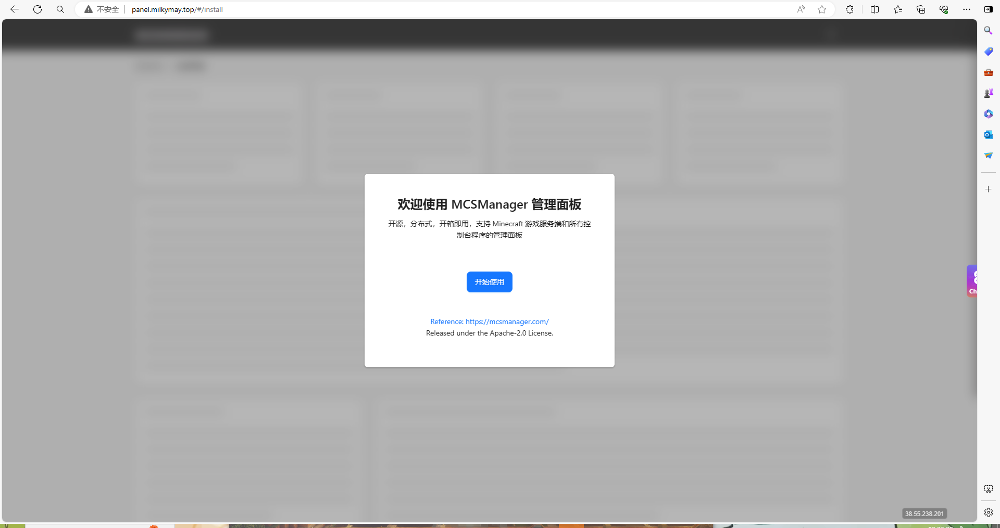
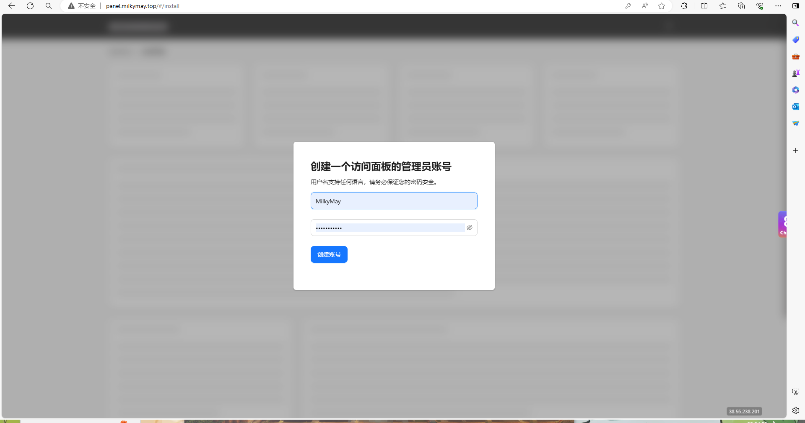
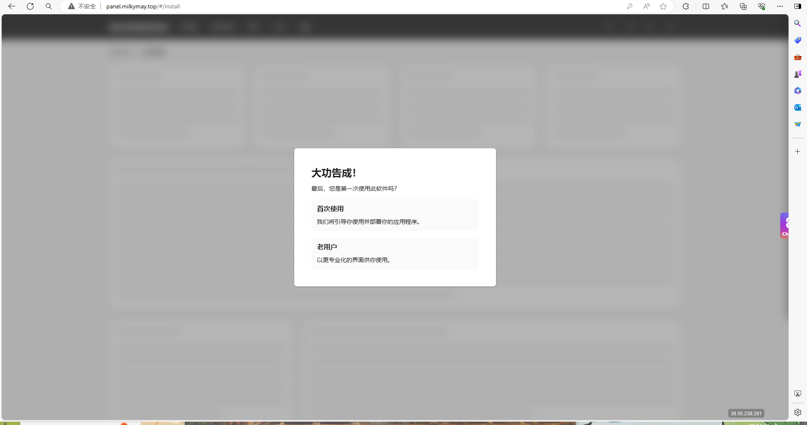

# MCSM搭建教程

本教程适用于不会MCSM搭建的用户

## windows版

### 一.搭建MCSM网站

首先 你得要有一个服务器
然后 用浏览器打开[MCSM官方](https://mcsmanager.com/)网址
点击中央的"下载"

点击"下载安装包"

选择Windows版本

点击下载

将压缩包解压成文件夹
将其打开

其中分为daemon和web文件夹
daemon是守护进程 管理服务器的
web是面板 是供用户使用的
（可以理解为daemon是后端 web是前端）

回到上一目录
双击start.bat启动面板及守护进程

（图中 左为web 右为daemon）
当你第一次启动时 它默认是英文 当你用浏览器（设置语言为中文的）访问后 自动变为中文

### 二.初始化面板

当你面板部署完成后 服务器会自动弹出网页面板
同时 你也可以用家中电脑访问 面板默认端口为23333
（如果连接不上 请检查你服务器是否拥有公网IP，是否放行了23333端口）

当你成功连上后 应该是这个页面

点击中央的"开始使用"

输入仅你知道的账号和密码

然后跟着他的引导就可以创建属于你的第一个实例了

