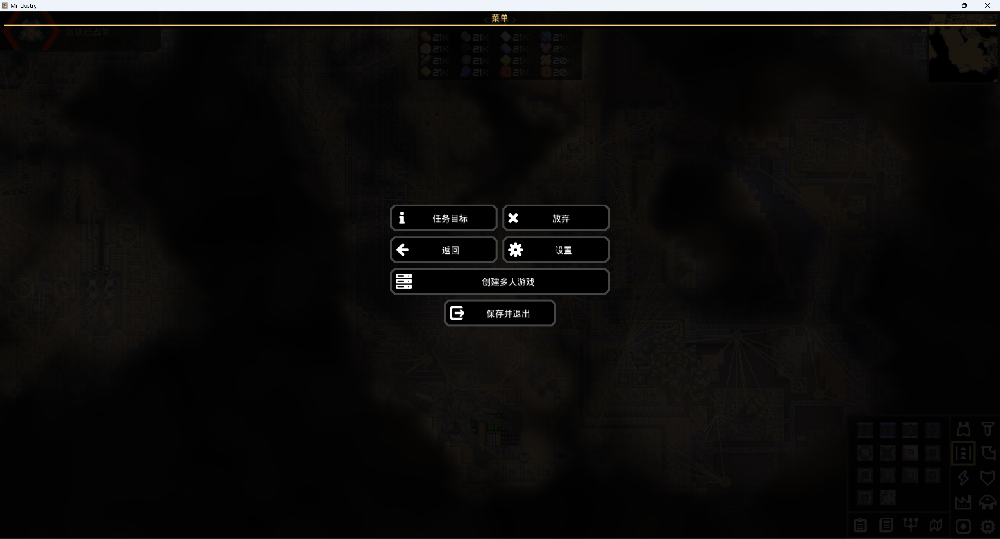
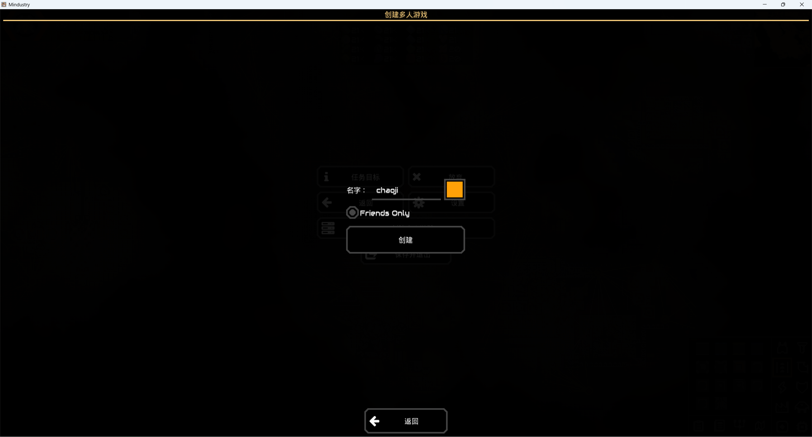
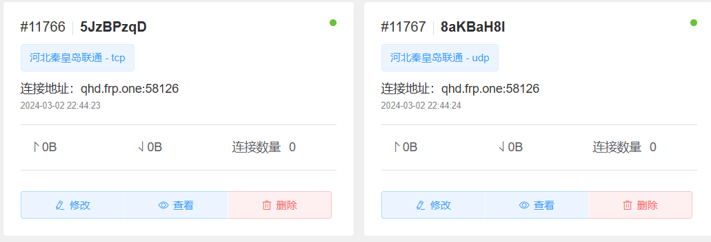
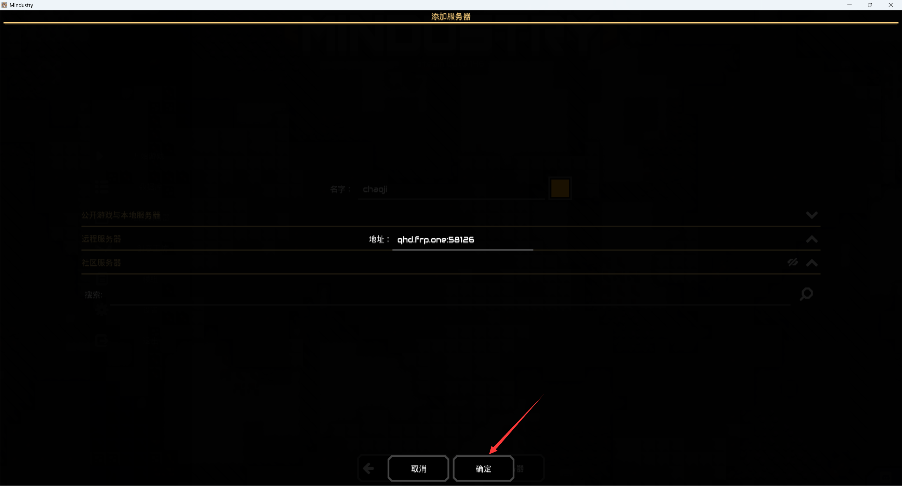

# 像素工厂联机教程

此教程为非Steam版好友联机(steam可用)，通过加入服务器联机，可适用于好友为手机版，或没有steam版本联机。

## Windows客户端联机

### 房主开房

打开像素工厂，点击"开始游戏->战役模式(这里可以选择其他模式，如:自定义游戏/载入游戏)"，随便选择一个星球/地区进入（这里以赛普罗-焦油田为例）

进入存档后点击键盘上的<kbd>ESC</kbd>呼出菜单。

接着点击 创建多人游戏 名字填写您的游戏名。"Friends Only"为私人游戏，如果不想让陌生人进入服务器，需要选择这个。

信息填好后点击"创建"

随后创建并启动ChmlFrp隧道。[点击跳转到映射使用教程](../use/mapping)

创建隧道时内网端口选择6567，需要创建两个隧道，一个类型选择TCP，另一个选择UDP，**两个隧道的外网端口和节点需一致**。

根据[ChmlFrp基础教程](../use/mapping)启动好隧道后，即可通过连接地址进入游戏。

---

### 玩家进入

打开像素工厂，点击"开始游戏->加入游戏"，呼出"加入游戏菜单"。名字填写您的游戏名。

然后点击正下方的添加服务器

输入ChmlFrp隧道提供的"连接地址"，然后点击"确定"即可。(此处填写的qhd.frp.one:58126为示例)

