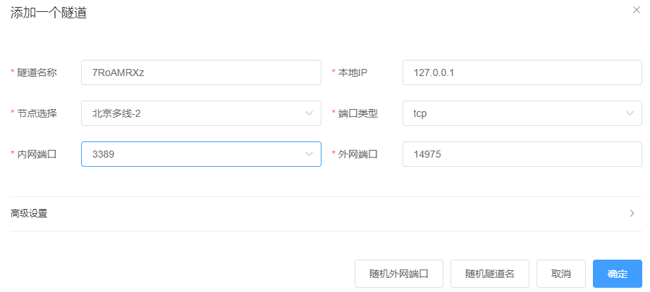
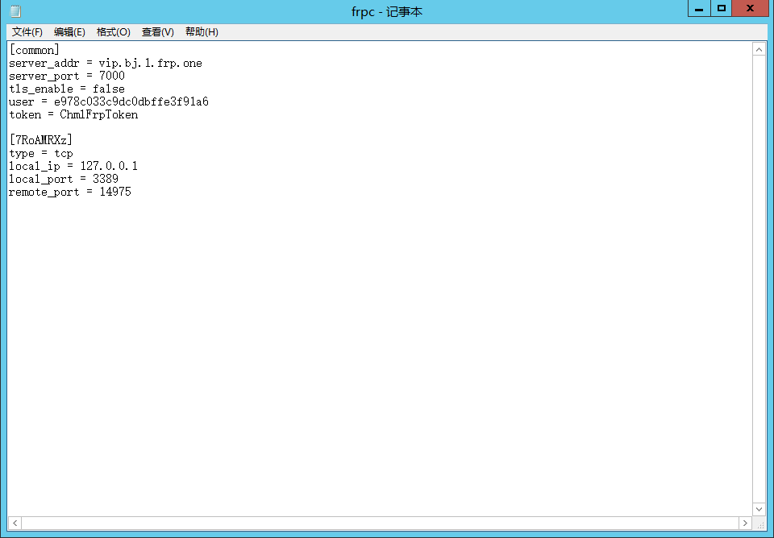
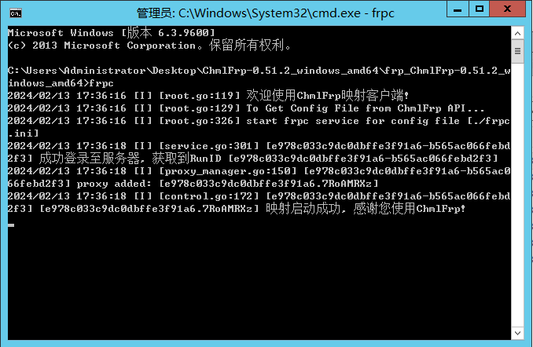
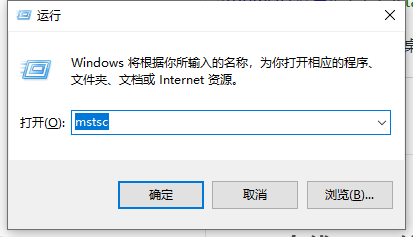
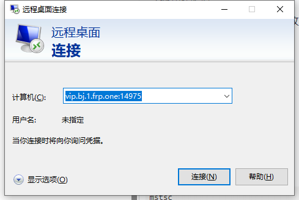
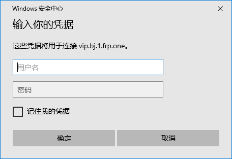

# windows服务器远程控制

## 被控端

访问[chmlfrp官网](https://panel.chmlfrp.cn)

进行创建隧道

[创建隧道教程文档](../use/mapping)

选择一个离你服务器近的节点

将内网端口改为3389（windows默认远程端口） 外网端口随意

协议使用TCP(或者可以TCP+UDP TCP一定需要 UDP可加速连接)



在被控中部署chmlfrp软件并更改frpc.ini文件



启动映射程序

等待映射启动完毕



## 主控端(Windows)

按下<kbd>win</kbd>和<kbd>R</kbd> 呼起"运行"

输入

```shell
mstsc
```



回车 呼出微软自带的"远程桌面连接"

输入ChmlFrp映射隧道提供的连接地址



点击连接

输入服务器账户的用户名密码（windows用户名和密码，如果主控没有启动密码登录，则需要启用密码登录） 可勾选记住我的凭据 这样下回就不用重新输入了



点击确定即可正常链接了

## Linux服务器ssh链接

暂无教程，请等待后续更新

## windows远程链接疑难解惑

Q1:我远程桌面链接FRP外网链接 但是显示"远程桌面由于以下原因之一无法链接远程计算机......"
A1:首先查看控制面板中 是否开启允许远程链接 然后查看frp是否正常启动 如果还不行 查看防火墙是否关闭