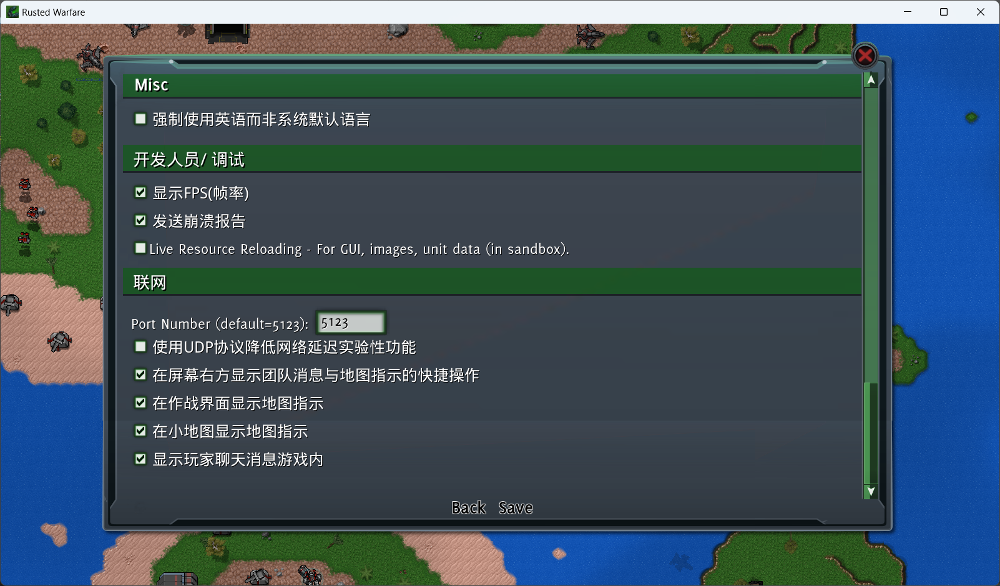
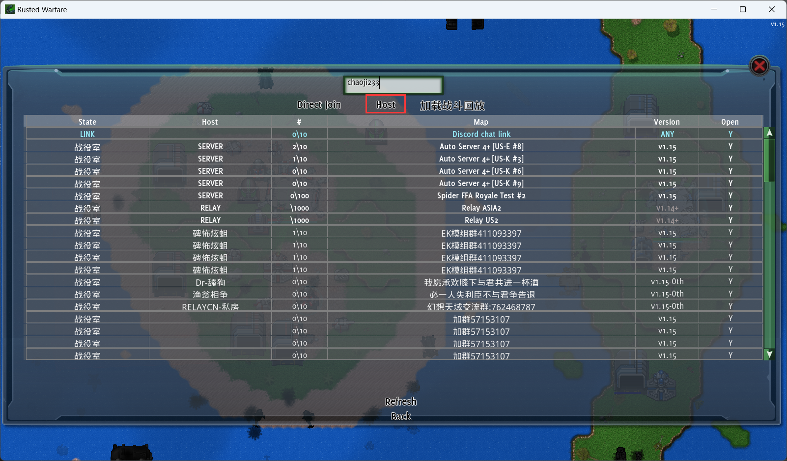
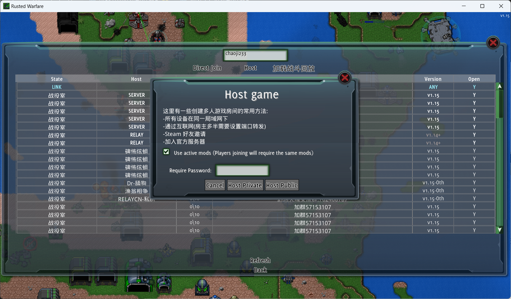
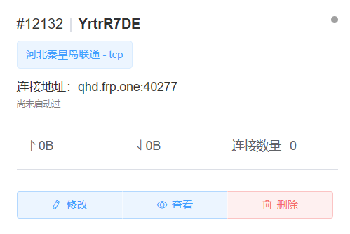
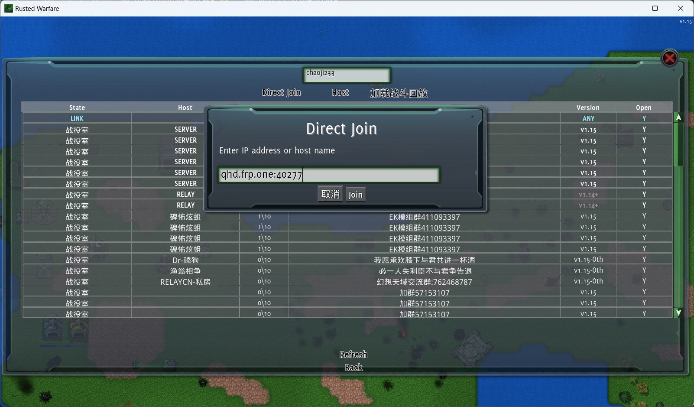

# 铁锈战争联机教程

## Windows客户端联机

### 房主开房

打开铁锈战争，点击"设置"，往下滑，找到"联网"中的"Port Number（default=5123）"

这里的Port Number（default=5123）为联机端口，默认为5123。记住这串数字。

然后点击多人游戏，在正上方的名称框输入您的游戏名，随后点击"Host"。

在弹出的Host game框中，勾选上"Use active mods（players joining will require the same mods）" 翻译为 "使用活动的mods（加入的玩家需要相同的mods）"。

中间的"Require Password"为房间密码，设置之后玩家连接到游戏需要输入正确的密码。

下方的"Cancel"为取消，"Host Private"为启动私人服务器，"Host Public"为启动公开服务器。这里点击"Host Public"。

随后创建并启动ChmlFrp隧道。[点击跳转到映射使用教程](../use/mapping)

创建隧道时内网端口填写设置页面中"Port Number（default=5123）"的端口，一般为5123，端口类型选择TCP(如果设置那边勾选了"使用UDP协议降低网络延迟实验性功能"，则还需要创建个UDP隧道，**内网端口和外网端口需要与TCP隧道一致**)

根据[ChmlFrp基础教程](../use/mapping)启动好隧道后，即可通过连接地址进入游戏。

---

### 玩家进入

打开铁锈战争，点击多人游戏，在正上方的名称框输入您的游戏名，随后点击"Direct Join"。

在弹出的"Direct Join"框中输入ChmlFrp隧道提供的"连接地址"，然后点击"Join"即可。(此处填写的qhd.frp.one:40277为示例)

