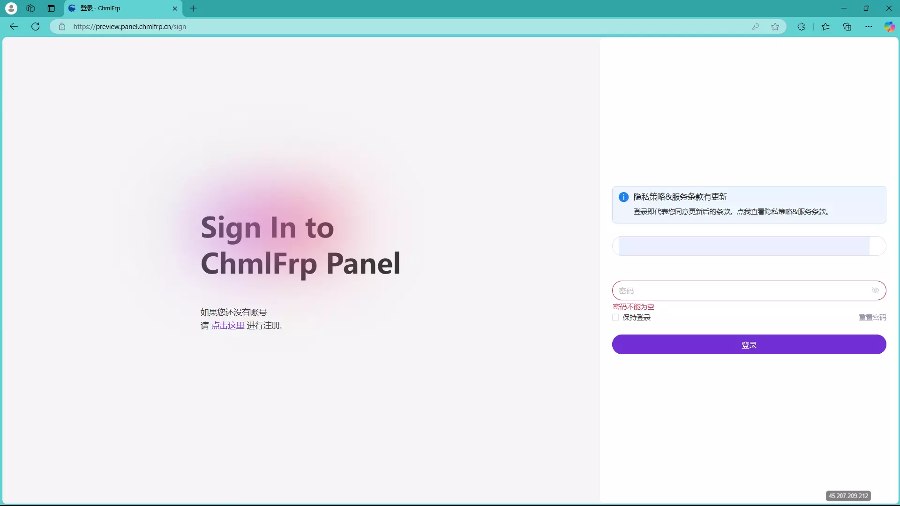
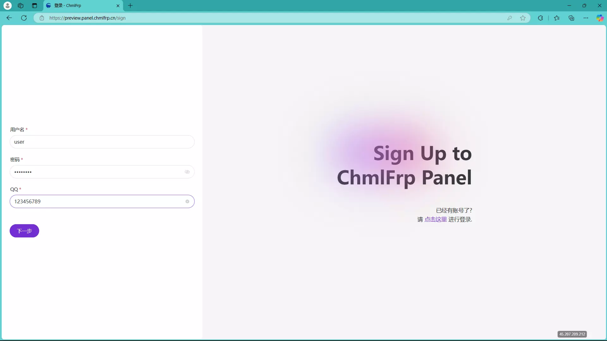
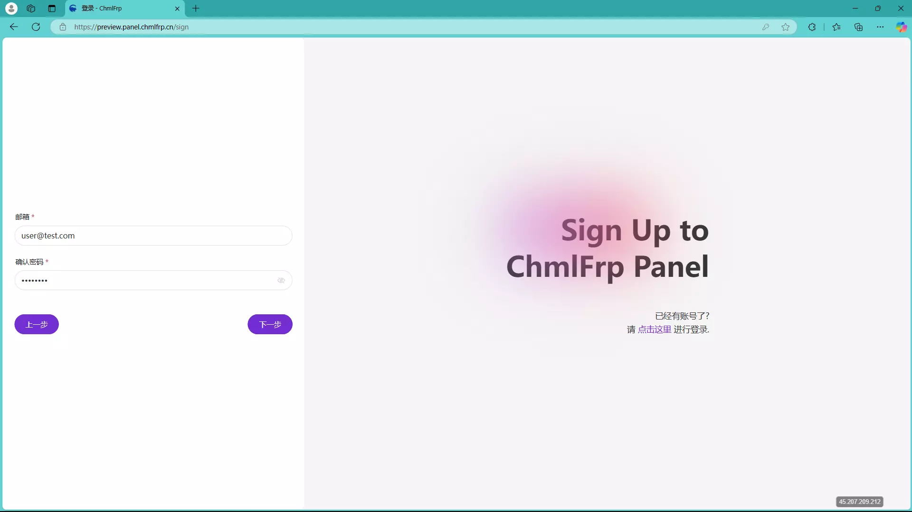
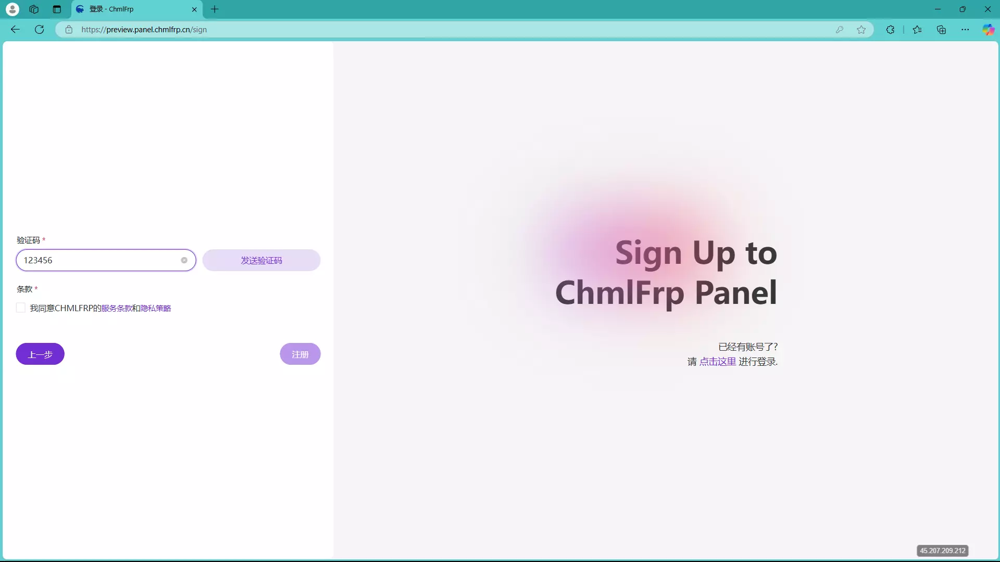
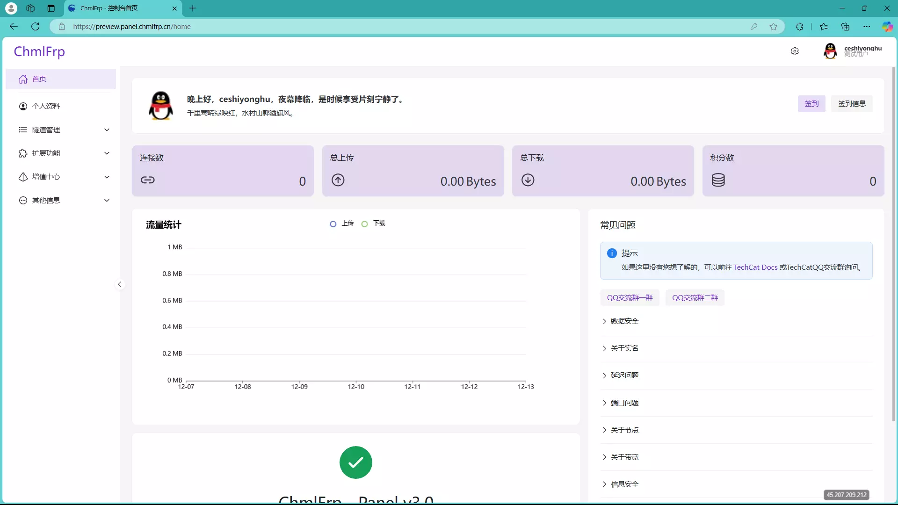
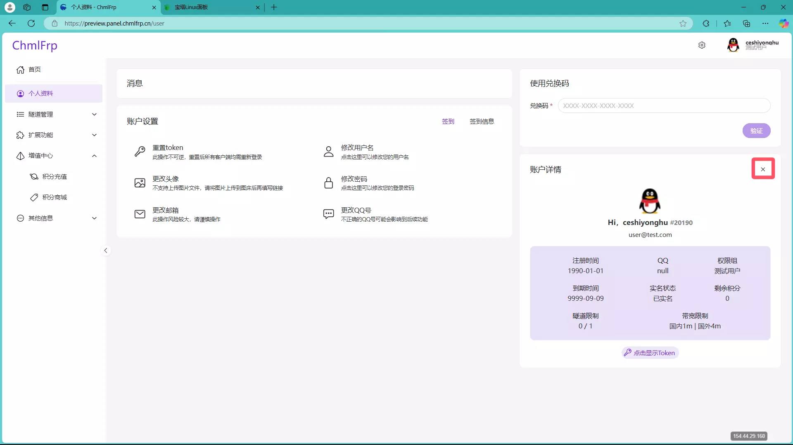
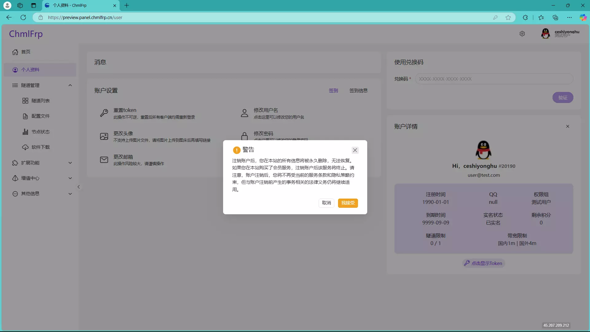
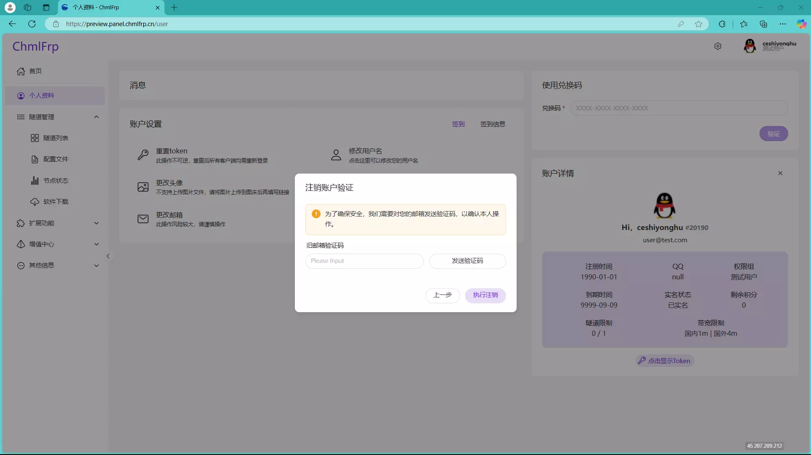

# 注册与注销账户

## 注册账户

首先进入[网页控制台](https://panel.chmlfrp.cn/sign)

注册请点击左侧紫色的"点击这里"进入注册页面

输入您想使用的用户名、密码与QQ号

输入您的邮箱和再次确认密码

获取邮箱验证码后填入上方并确认条款

点击注册按钮即可注册

## 注销账户

首先 正常登录到[网页控制台](https://panel.chmlfrp.cn/home)

进入到"个人资料"

点击账户信息右上角的×

在确认信息中选择"我接受"

获取并填写邮箱验证码后 点击"执行注销"即可

