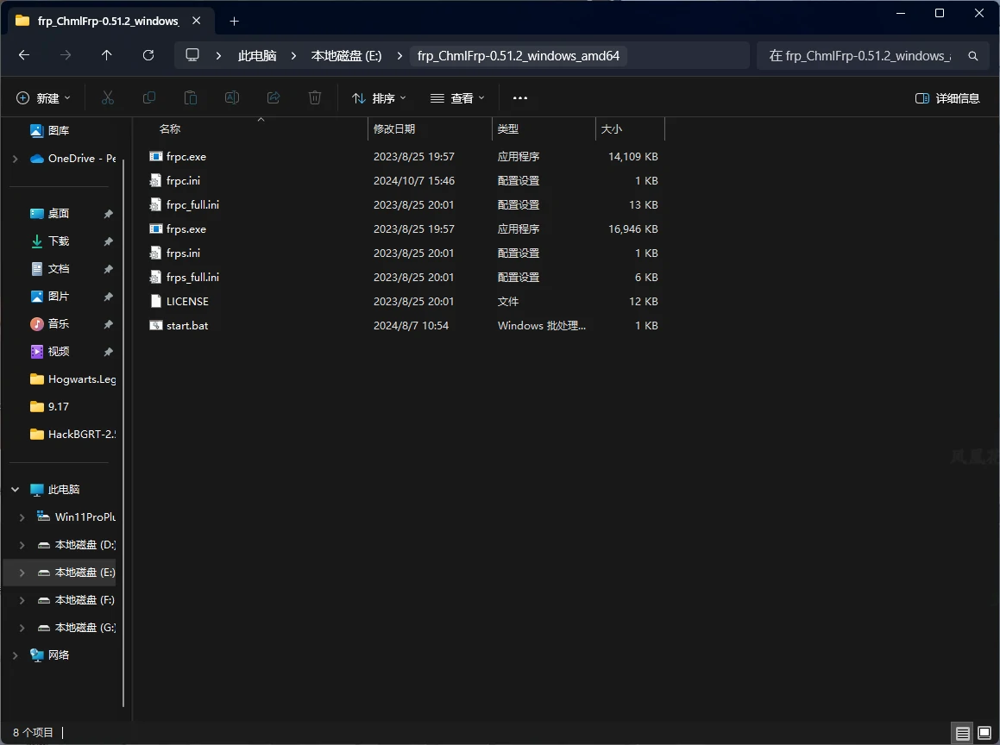
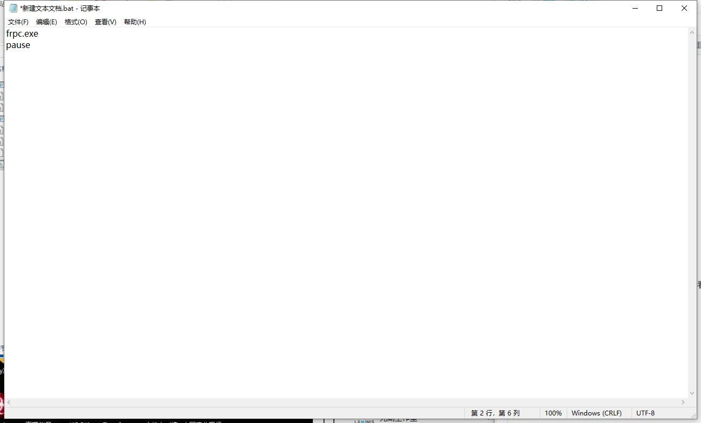
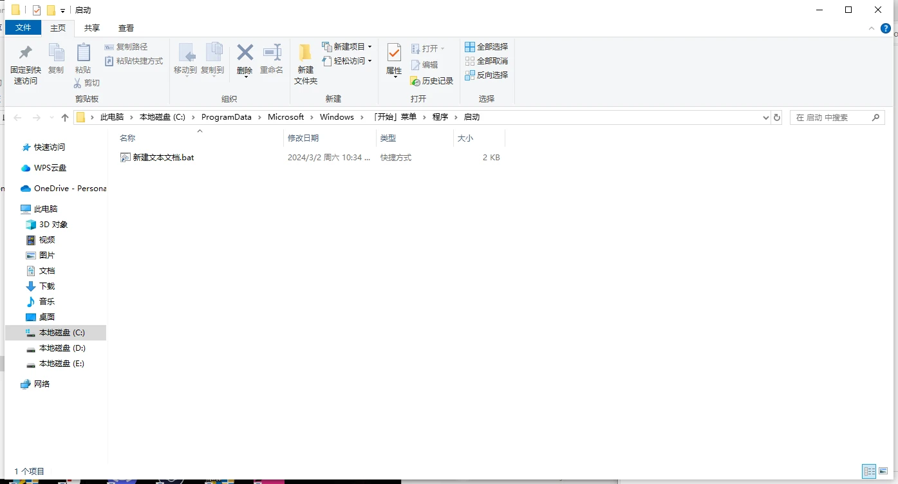

# Windows开机自启动教程

本教程将指导您如何在Windows系统中设置ChmlFrp客户端开机自启动，让您的内网穿透服务在系统启动时自动运行。

## 前置条件

在开始之前，请确保您已具备以下条件：

- ✅ 已下载并配置好ChmlFrp客户端
- ✅ 隧道已能正常启动和运行
- ✅ 了解基本的Windows操作
- ✅ 具有管理员权限（如需要）

> **💡 重要提示**  
> 开机自启动功能需要确保frpc.ini配置文件路径正确，且客户端文件不会被移动或删除。

## 方法一：使用启动文件夹

### 1. 打开系统启动文件夹

1. **使用运行命令**
   - 按 <kbd>Win</kbd> + <kbd>R</kbd> 键打开运行窗口
   - 输入以下命令：

```shell
shell:Common Startup
```


2. **确认启动文件夹**
   - 点击"确定"按钮
   - 弹出的文件夹就是系统启动文件夹


### 2. 创建启动脚本

1. **返回frpc文件夹**
   - 回到您的ChmlFrp客户端文件夹



2. **创建批处理文件**
   - 新建一个文本文档
   - 将文件重命名，后缀从 `.txt` 改为 `.bat`
   - 确认更改文件扩展名


3. **编辑启动脚本**
   - 右键点击bat文件，选择"编辑"
   - 输入以下代码：

```batch
frpc.exe
pause
```

> **💡 脚本说明**  
> - `frpc.exe`：启动frpc客户端
> - `pause`：暂停以便查看日志（可选）



4. **保存文件**
   - 按 **Ctrl+S** 保存文件
   - 关闭文本编辑器

### 3. 设置开机自启动

1. **创建快捷方式**
   - 右键点击 `.bat` 文件
   - 选择"创建快捷方式"

2. **移动到启动文件夹**
   - 将创建的快捷方式剪切到系统启动文件夹
   - 如需要管理员权限，请提供相应权限



3. **验证设置**
   - 重启电脑
   - 检查frpc是否自动启动

## 方法二：使用任务计划程序

### 1. 打开任务计划程序

1. **启动任务计划程序**
   - 按 <kbd>Win</kbd> + <kbd>R</kbd> 键
   - 输入 `taskschd.msc` 并回车

2. **创建基本任务**
   - 在右侧点击"创建基本任务"
   - 输入任务名称：`ChmlFrp自启动`

### 2. 配置任务触发器

1. **设置触发器**
   - 选择"计算机启动时"
   - 点击"下一步"

2. **配置操作**
   - 选择"启动程序"
   - 程序路径：选择您的 `frpc.exe` 文件
   - 起始位置：选择frpc文件夹路径

### 3. 完成配置

1. **设置用户权限**
   - 勾选"使用最高权限运行"
   - 点击"完成"

2. **测试任务**
   - 右键点击创建的任务
   - 选择"运行"测试是否正常

## 方法三：使用注册表

### 1. 打开注册表编辑器

1. **启动注册表编辑器**
   - 按 <kbd>Win</kbd> + <kbd>R</kbd> 键
   - 输入 `regedit` 并回车

2. **导航到启动项**
   - 找到路径：`HKEY_CURRENT_USER\Software\Microsoft\Windows\CurrentVersion\Run`

### 2. 添加启动项

1. **创建新字符串值**
   - 右键点击空白处
   - 选择"新建" → "字符串值"
   - 命名为：`ChmlFrp`

2. **设置启动路径**
   - 双击新建的字符串值
   - 数值数据：`"C:\path\to\frpc.exe"`（替换为实际路径）

## 验证和测试

### 1. 测试自启动

1. **重启系统**
   - 重启电脑
   - 观察frpc是否自动启动

2. **检查运行状态**
   - 查看任务管理器中的frpc进程
   - 检查隧道连接状态

### 2. 手动重启服务

如果需要手动重启frpc服务：

1. **停止当前服务**
   - 关闭正在运行的命令提示符窗口
   - 或使用任务管理器结束frpc进程

2. **重新启动**
   - 双击启动脚本文件
   - 或使用命令行启动