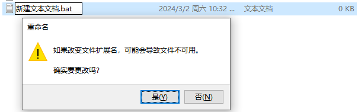
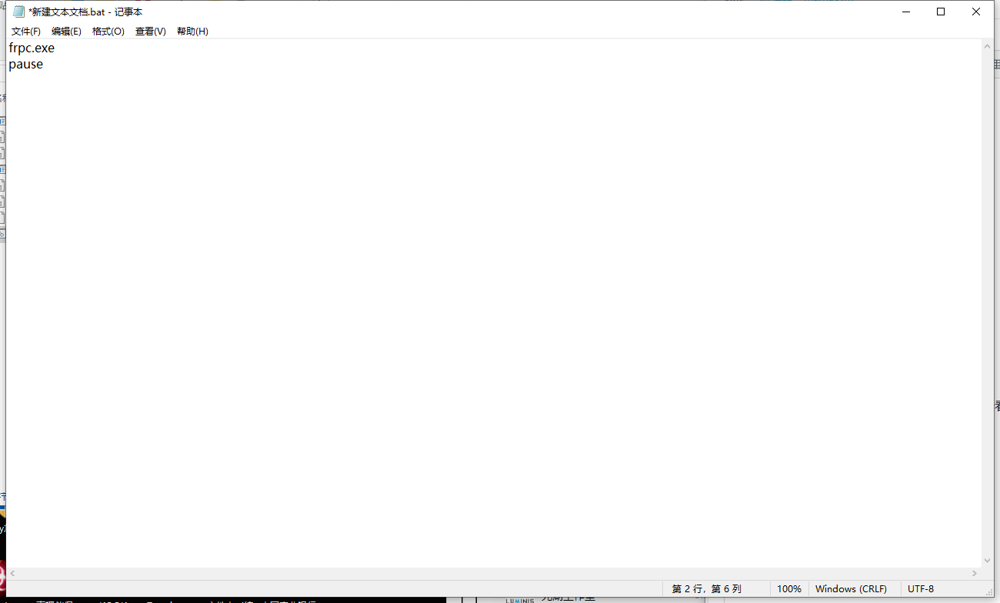
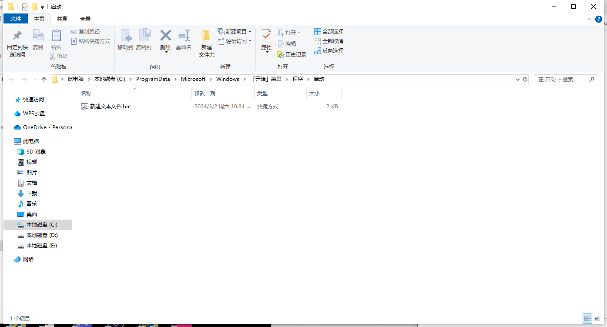

# windows设置开机启动FRP

首先 打开 **"启动"** 文件夹

<kbd>win</kbd>+<kbd>R</kbd>键打开运行窗口
输入以下代码

```shell
shell:Common Startup
```


点击确定
弹出的文件夹就是系统启动文件夹


回到frp文件夹



新建文本文档
修改文件后缀词.txt为.bat
确认更改



右键，点击编辑
输入以下代码

```shell
frpc.exe
pause
```

注：frpc.exe是启动FRPC pause是为了方便检修看日志



保存，关闭文件

右键.bat文件 创建快捷方式
将快捷方式剪切到"启动"文件夹（可能要提供管理员权限）


重启电脑
frp就成功开机启动了

如果想重启frpc 不需要重启 只需将之前的命令提示符关闭，然后双击启动.bat文件