# ChmlFrp 端口映射教程

本教程将指导您如何使用ChmlFrp进行端口映射，包括创建隧道和在不同操作系统上启动隧道的完整流程。

## 前置条件

在开始之前，请确保您已具备以下条件：

- ✅ 已注册ChmlFrp账号并完成实名认证
- ✅ 了解基本的网络概念（端口、IP地址等）
- ✅ 已安装对应操作系统的frpc客户端
- ✅ 了解您要映射的服务的端口信息

## 快速开始

### 视频教程

[【ChmlFrp V3版食用教程】 —— UP:MilkyMay5201314](https://www.bilibili.com/video/BV13wewz8EBN)

### 常见问题

**Q: 如何启动多个隧道？**  
A: 
- 如果是不同的节点：启动多个frpc软件即可
- 如果是相同的节点：重新获取配置文件，配置文件默认启动此节点的所有隧道，然后剪切进frpc.ini再重启即可

## 第一步：创建隧道

### 1.1 登录控制台

1. **访问官网**
   - 打开 [ChmlFrp官网](https://chmlfrp.cn)
   - 点击"管理面板"按钮

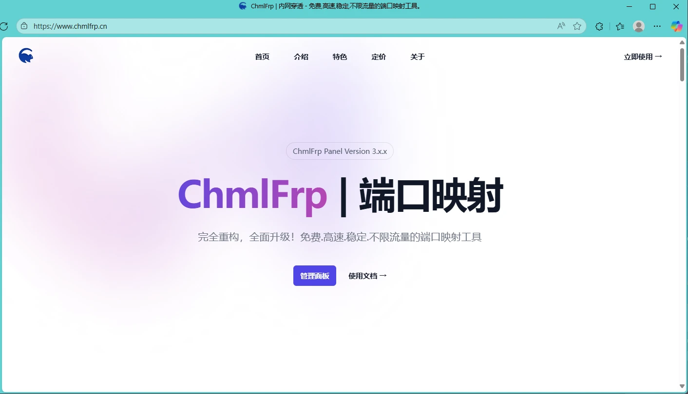

2. **注册/登录账户**
   - 如果没有账户，请先注册
   - 已有账户可直接登录

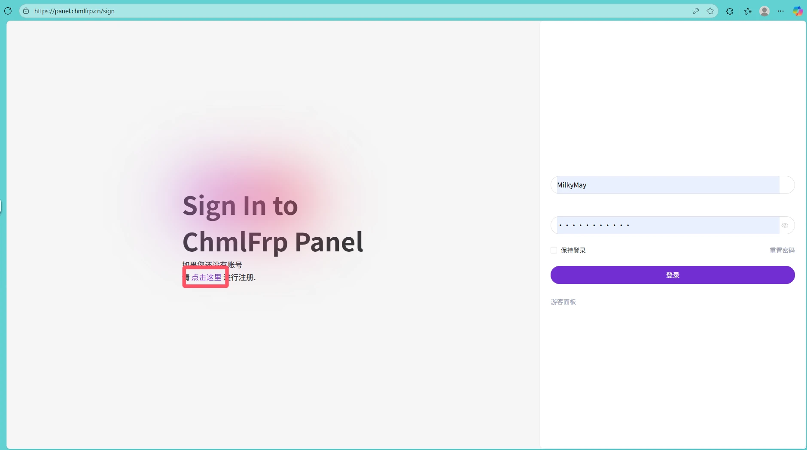
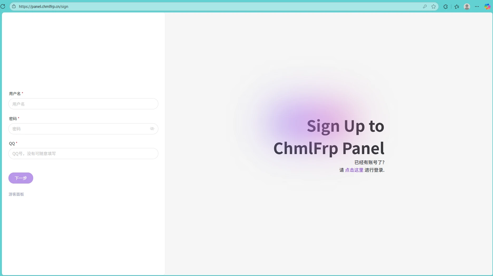


3. **完成实名认证**
   - 如果未实名认证，主页会显示"您尚未实名"
   - 点击实名提示框完成实名认证

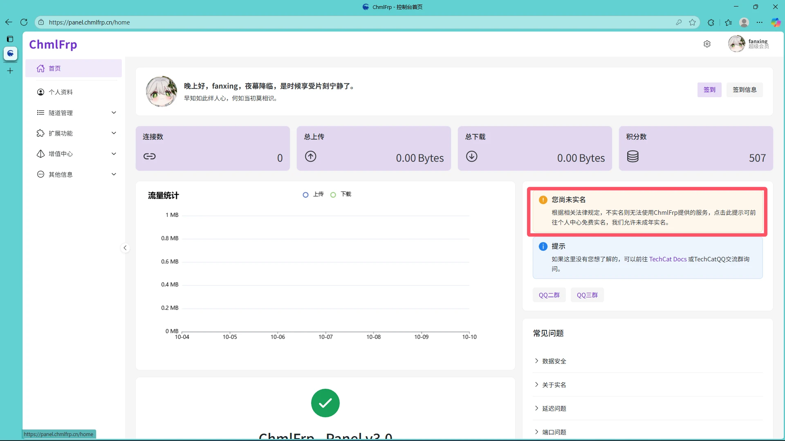

### 1.2 创建隧道

1. **进入隧道管理**
   - 实名认证后，依次点击"隧道管理" → "隧道列表"
   - 点击右上角"添加隧道"

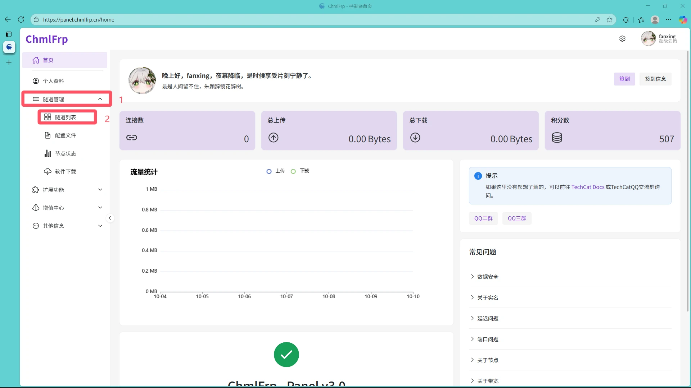
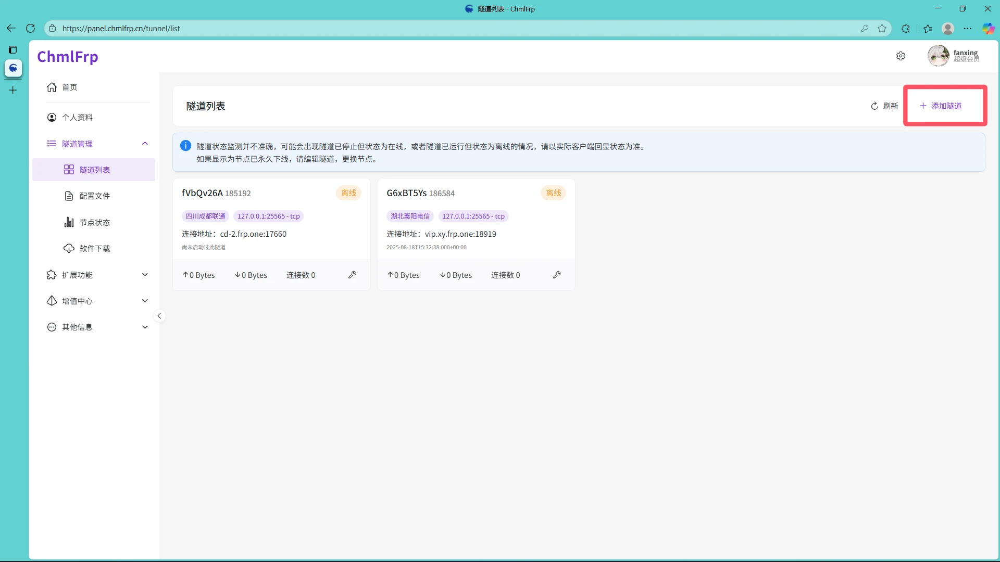

2. **选择节点**
   - 根据您的需求选择合适的节点
   - 查看节点信息，包括节点的介绍、负载等

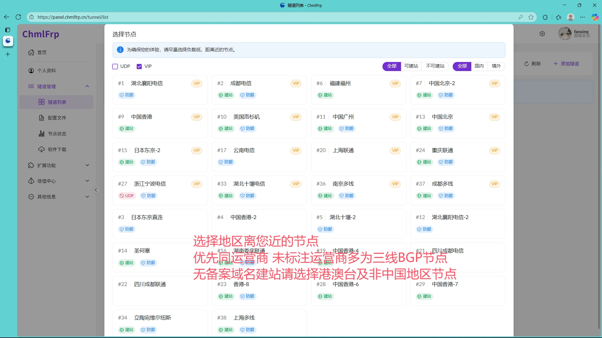
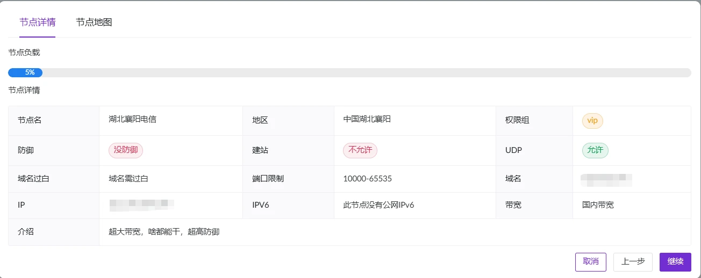

3. **配置隧道参数**
   - 点击"继续"进入配置页面
   - 填写以下信息：

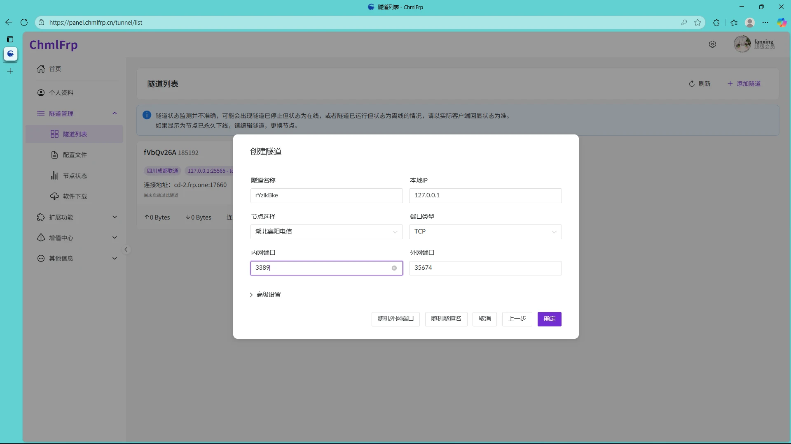

| 配置项 | 说明 | 示例 |
|--------|------|------|
| **隧道名称** | 隧道的名字，可以自定义 | `my-tunnel` |
| **本地IP** | 要映射的本地IP地址 | `127.0.0.1`（本机） |
| **端口类型** | 协议类型 | `TCP`、`UDP`、`HTTP`、`HTTPS` |
| **内网端口** | 本地服务端口号 | `8080`、`25565`等 |
| **外网端口** | 外网访问端口号 | 自定义（避免重复） |

> **💡 配置说明**  
> - **本地IP**：本机使用`127.0.0.1`，局域网其他机器使用该机器的内网IP
> - **端口类型**：HTTP/HTTPS用于网页服务，TCP/UDP用于游戏等
> - **HTTPS**：需要自备SSL证书并配置好
> - **高级设置**：非必要不建议修改
> - **特别提醒**：如果您使用了中国境内节点，映射任何网页服务，您都需要解析自己的已备案域名，并且通过自己的域名访问。

4. **完成创建**
   - 检查配置无误后点击"确定"
   - 隧道创建成功后，系统会显示外网连接地址

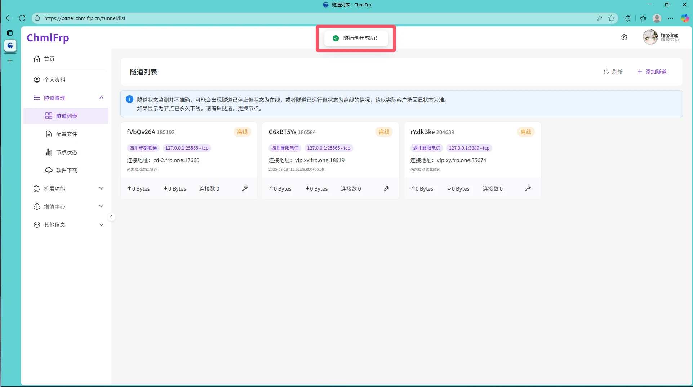

> **🎉 恭喜！**  
> 您的内网穿透隧道已创建成功，外网地址就是连接地址。

## Windows系统启动

### 下载frpc客户端

1. **访问下载页面**
   - 打开 [ChmlFrp软件下载页面](https://panel.chmlfrp.cn/tunnel/download)
   - 选择Windows版本

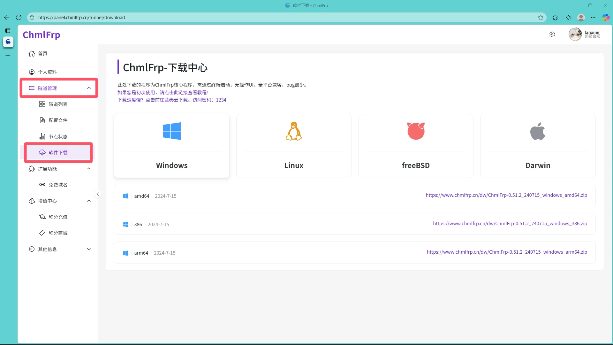

2. **选择正确的版本**
   - **64位系统**：选择 `amd64` 版本
   - **32位系统**：选择 `386` 版本

> **💡 如何查看系统位数**  
> 右键"此电脑" → "属性"，在"系统类型"中查看操作系统位数

3. **下载并解压**
   - 下载完成后解压压缩包
   - 进入解压后的文件夹

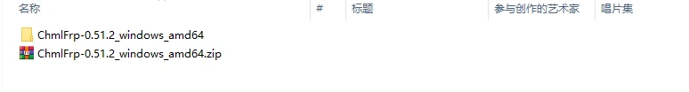
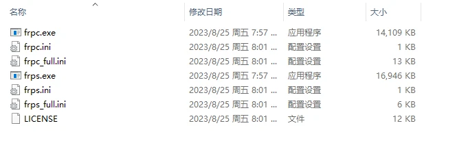

### 配置frpc

1. **准备配置文件**
   - 双击打开 `frpc.ini` 文件（备用）

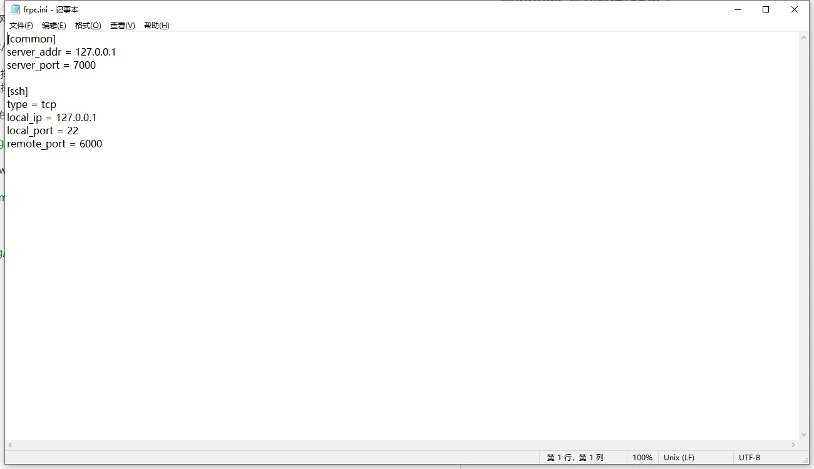

2. **获取配置文件**
   - 打开 [ChmlFrp配置文件页面](https://panel.chmlfrp.cn/tunnel/config)
   - 依次进行以下操作：
     - 选择要映射的隧道节点
     - 点击"生成配置文件"
     - 复制配置文件内容

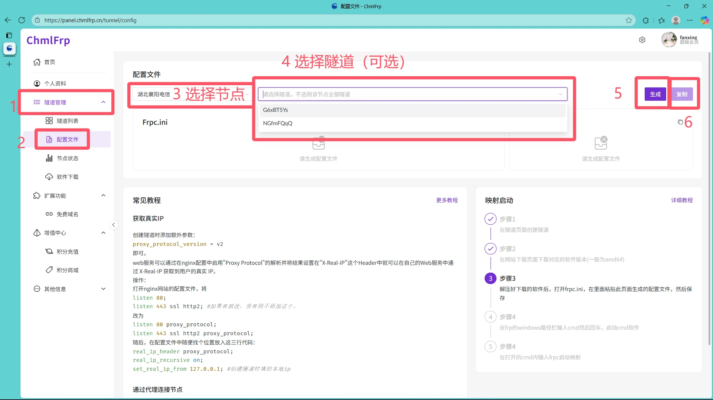

3. **配置frpc.ini**
   - 将复制的配置文件粘贴到 `frpc.ini` 文件中
   - 按 **Ctrl+S** 保存文件

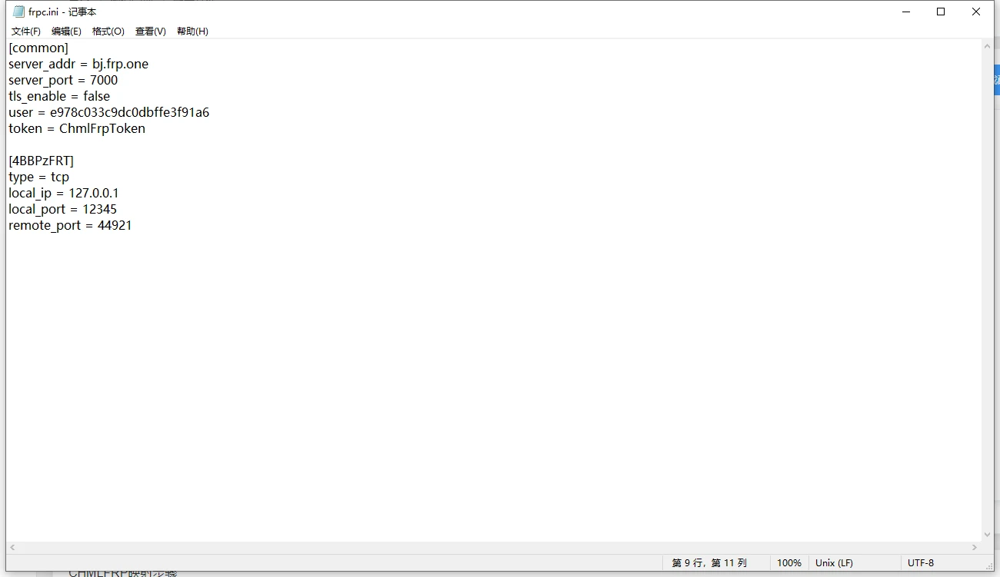

### 启动隧道

1. **打开命令提示符**
   - 在文件夹地址栏输入 `cmd` 并回车
   - 使用当前地址打开命令提示符

2. **启动frpc**
   - 输入 `frpc.exe` 启动客户端
   - 等待出现"映射启动成功, 感谢您使用ChmlFrp!"提示

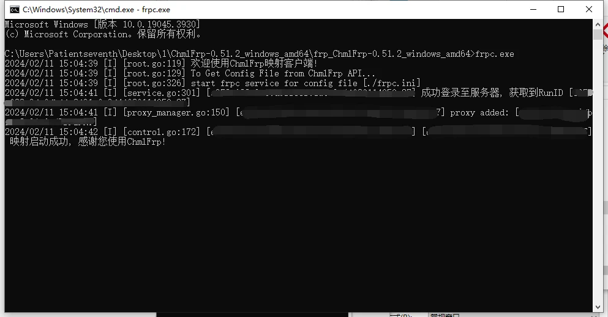

> **🎉 启动成功！**  
> 当看到"映射启动成功"提示时，您的隧道已成功启动，可以通过外网地址访问您的服务。

## Linux系统启动

### 连接服务器

1. **SSH连接**
   - 使用SSH客户端连接到您的Linux服务器
   - 这里以CentOS 7.9为例

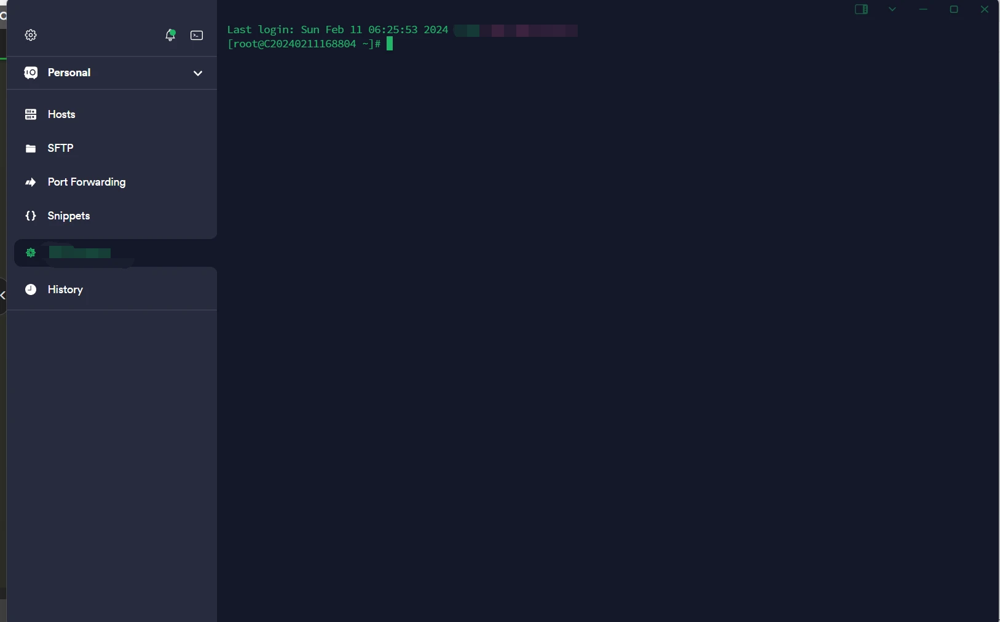

### 下载frpc客户端

1. **下载客户端**
   - 根据您的系统架构下载对应版本
   - 这里以amd64架构为例

```shell
wget https://chmlfrp.cn/dw/ChmlFrp-0.51.2_linux_amd64.tar.gz
```

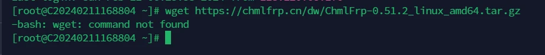

2. **安装wget（如需要）**
   - 如果提示"wget: command not found"，请先安装wget

**CentOS系统：**
```shell
yum install wget
```

**Ubuntu系统：**
```shell
sudo apt-get install wget
```

> **💡 安装提示**  
> 如果出现"Is this ok [y/d/N]:"，直接输入 `y` 然后回车即可。

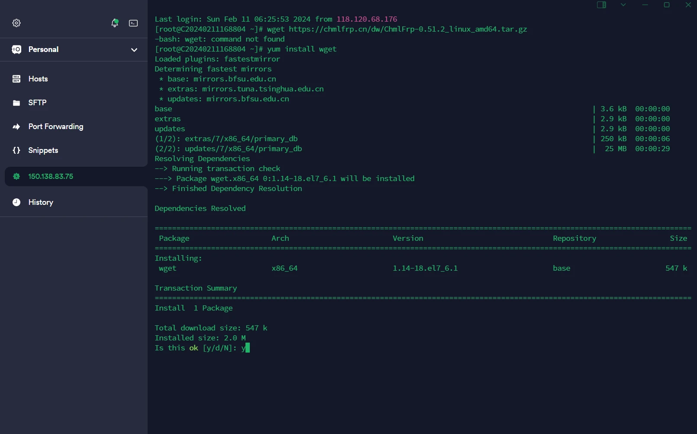

3. **重新下载（如需要）**
   - 安装wget后，重新执行下载命令

```shell
wget https://chmlfrp.cn/dw/ChmlFrp-0.51.2_linux_amd64.tar.gz
```

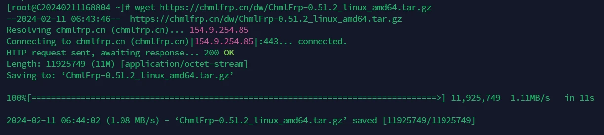

### 解压和配置

1. **解压文件**
   - 解压下载的tar.gz包

```shell
tar -zxf ChmlFrp-0.51.2_linux_amd64.tar.gz
```

2. **进入目录**
   - 查看解压后的文件
   - 进入frpc目录

```shell
ls
cd frp_ChmlFrp-0.51.2_linux_amd64
```

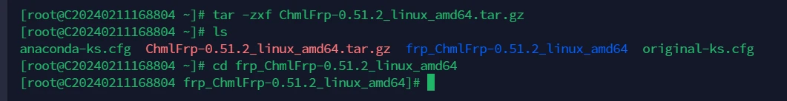

3. **获取配置文件**
   - 访问 [ChmlFrp控制面板](https://panel.chmlfrp.cn)
   - 依次点击"隧道管理" → "配置文件"
   - 选择节点并生成配置文件

> **⚠️ 注意**  
> 只有创建过隧道才能选择节点，否则列表为空。

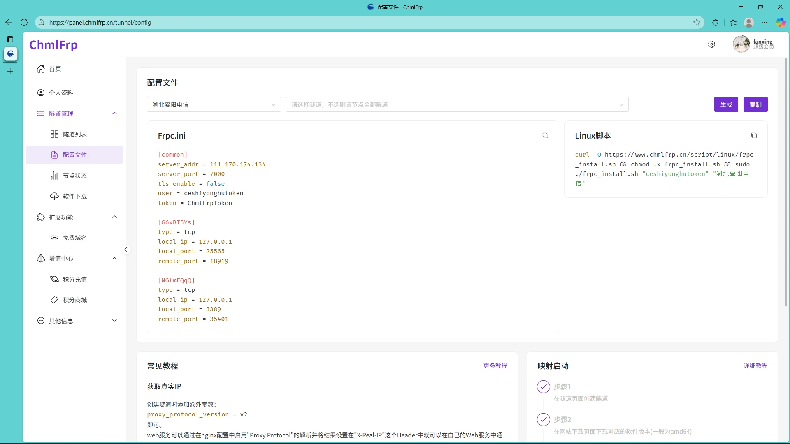

4. **编辑配置文件**
   - 使用vi编辑器打开frpc.ini文件

```shell
vi frpc.ini
```

5. **编辑配置内容**
   - 按 `i` 键进入编辑模式
   - 删除原有内容，粘贴从网站获取的配置
   - 按 `ESC` 键退出编辑模式
   - 输入 `:wq` 保存并退出

> **💡 SSH粘贴方法**  
> 不同SSH客户端粘贴方法可能不同：
> - 右键粘贴
> - Ctrl+V粘贴  
> - Ctrl+Shift+V粘贴

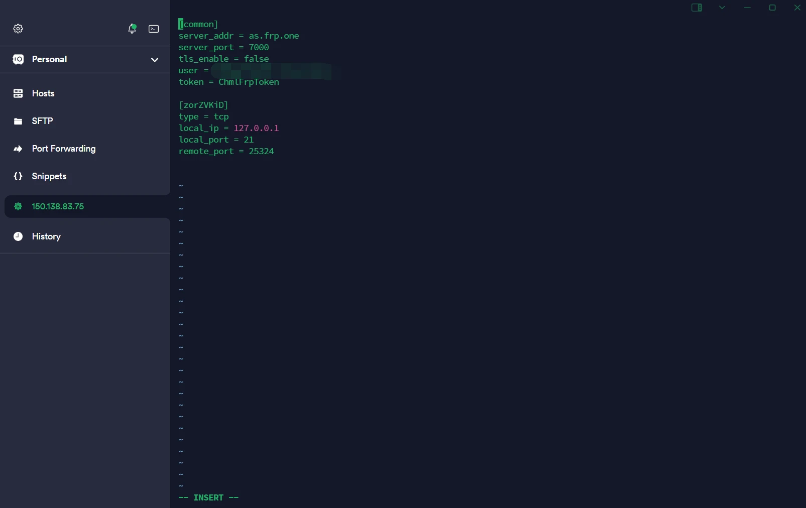

### 启动隧道

1. **测试启动**
   - 使用以下命令测试隧道是否能正常启动

```shell
./frpc -c frpc.ini
```

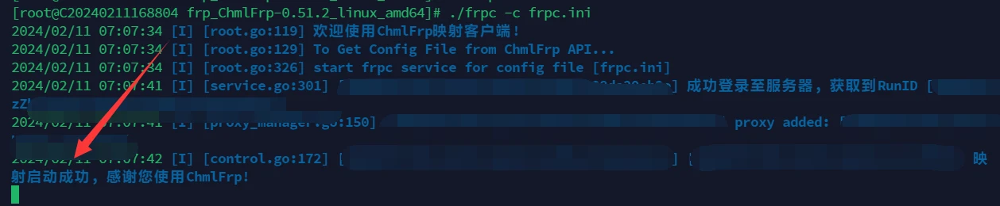

2. **后台运行（推荐）**
   - 按 `Ctrl+C` 停止当前运行
   - 使用后台运行命令

```shell
nohup ./frpc -c frpc.ini >/dev/null 2>&1 &
```

> **💡 后台运行说明**  
> - 出现类似"[1] 16047"的提示表示后台启动成功
> - 16047为进程ID，每个人的数字都不同
> - 如需结束进程，使用 `kill 16047` 命令

> **🎉 启动成功！**  
> 当看到"映射启动成功"提示时，您的隧道已成功启动，可以通过外网地址访问您的服务。

## macOS系统启动

### 下载frpc客户端

1. **访问下载页面**
   - 打开 [ChmlFrp软件下载页面](https://panel.chmlfrp.cn/tunnel/download)
   - 系统选择 `Darwin`
   - 根据您的Mac芯片选择对应架构：
     - **M1/M2芯片**：选择 `arm64`
     - **英特尔芯片**：选择 `amd64`

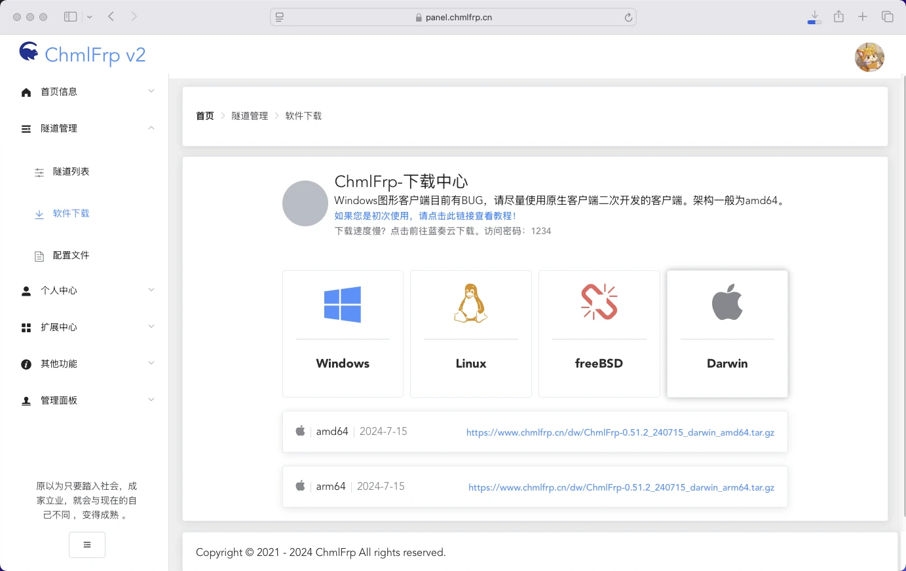

2. **下载并解压**
   - 下载完成后解压缩文件
   - 进入解压后的文件夹

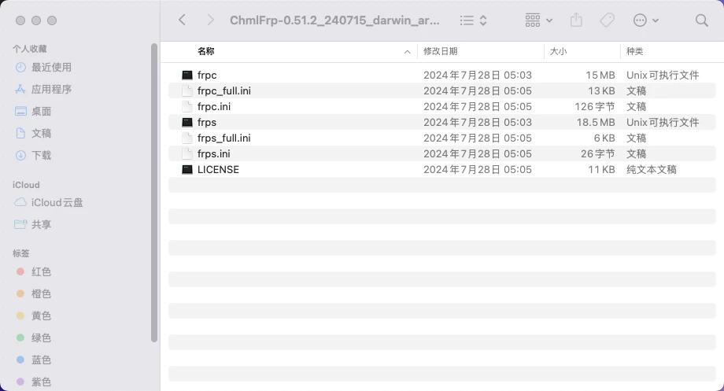

### 配置frpc

1. **获取配置文件**
   - 访问 [ChmlFrp控制面板](https://panel.chmlfrp.cn)
   - 前往"隧道管理" → "配置文件"页面
   - 生成要启动的配置文件并复制

2. **编辑配置文件**
   - 右键点击 `frpc.ini` 文件
   - 选择"打开方式" → "文本编辑器"

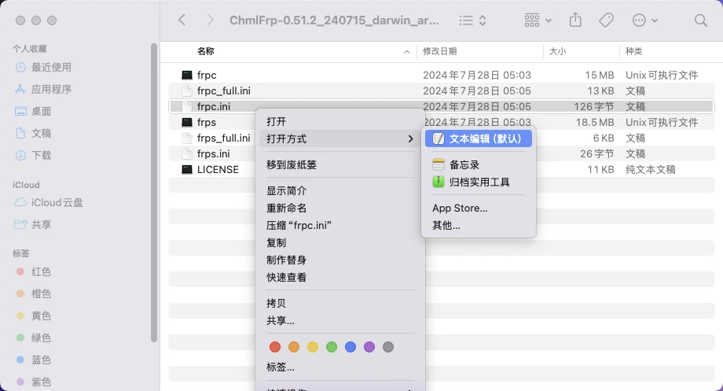

3. **粘贴配置内容**
   - 将复制的配置文件粘贴到 `frpc.ini` 文件中
   - 保存文件

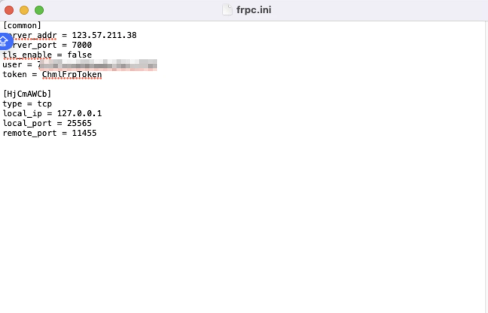

### 启动隧道

1. **打开终端**
   - 打开macOS终端应用
   - 进入ChmlFrp文件夹

```shell
cd 解压后的ChmlFrp文件夹路径
```

2. **启动frpc**
   - 使用以下命令启动客户端

```shell
./frpc
```

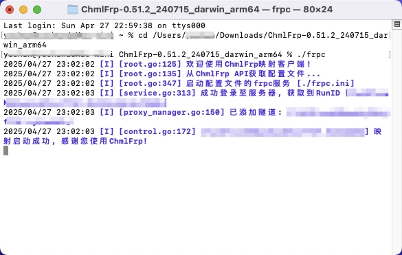

> **🎉 启动完成！**  
> 当看到"映射启动成功"提示时，您的隧道已成功启动，可以通过外网地址访问您的服务。

## 故障排除

### 常见问题

**Q: 隧道启动失败？**  
A: 请检查以下几点：
- 配置文件是否正确
- 网络连接是否正常
- 本地服务是否正在运行
- 端口是否被其他程序占用

**Q: 无法访问外网地址？**  
A: 请确认：
- 隧道状态显示为"在线"
- 本地服务正在运行
- 防火墙没有阻止相关端口
- 外网地址输入正确

**Q: 配置文件格式错误？**  
A: 请确保：
- 配置文件使用UTF-8编码保存
- 没有多余的空格或特殊字符
- 配置内容完整且格式正确
- 节点选择正确

**Q: Linux后台运行失败？**  
A: 请尝试：
- 检查进程是否正在运行：`ps aux | grep frpc`
- 查看日志文件：`cat nohup.out`
- 重新启动：`kill 进程ID` 然后重新运行

### 获取帮助

如果遇到其他问题，您可以：
- 查看ChmlFrp官方文档
- 联系技术支持
- 在社区群寻求帮助
- 查看视频教程获取更多帮助